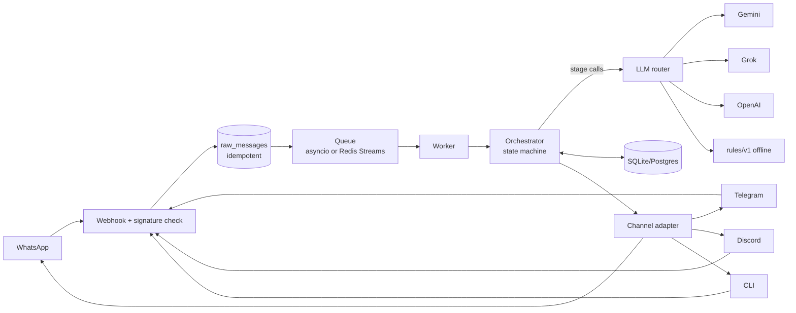

# Pocket

**A personal finance memory you talk to.** Text it the way you'd text a friend (on WhatsApp, Telegram, Discord or a terminal) and it extracts, categorizes, tags, converts currency and stores it. When it isn't sure, it asks first.

```
You   : 23 eur groceries at rimi today
Pocket: ✅ Logged €23.00 · Groceries · #rimi #groceries · Today 21:14
        (reply "undo" or "edit" within 5 min to change)
You   : sorry it was 29
Pocket: ✏️ Updated last transaction: €23.00 → €29.00
You   : coffee w/ arjun 6.50 and then metro 2
Pocket: Two transactions?
        1. €6.50 · Cafes · #coffee #arjun · with Arjun
        2. €2.00 · Transport · #metro
        Reply "yes" to save both, "1" or "2" to save one, or tell me what's off.
You   : chiya 30 rupees aja
Pocket: ✅ Logged ₨30.00 (~€0.17) · Cafes · #chiya · Today 21:16
        Base currency EUR; NPR converted at 174.82, ECB 2026-09-25.
You   : kati kharcha bhayo yo hapta grocery ma?
Pocket: This week (so far) · Groceries: €29.00 spent across 1 transaction.
```


## What makes it more than a prompt

- **A staged LLM pipeline, not one prompt.** Intent → extraction (structured JSON schema) → categorization → policy. Each stage is small, testable and has its own model chain. Anything deterministic (undo, edit 2 amount 29, show week, budgets) never touches a model.
- **Vendor-agnostic, free-first routing.** Gemini → Grok → OpenAI → an **offline rule-based parser**, per stage, via LiteLLM. Fallback triggers on rate limits, timeouts, 5xx, context overflow and **schema-validation failures** (retry once, then move on). Models near their free-tier quota are skipped before they 429. There's a daily $ cap, and past it only free backends run.
- **Works with zero API keys.** The rules backend handles the common shapes ("23 eur groceries at rimi", "sorry it was 29", "how much grocery this month?", romanized Nepali) and reports honest confidence, so shaky parses ask for confirmation.
- **The LLM proposes; the system confirms.** Confidence gating, novel-category confirmation (no category explosion), duplicate detection, multi-transaction confirmation.
- **Nothing is lost or silently overwritten.** Every inbound message is persisted before processing (idempotent on the provider's message id, so webhook retries can't double-log). Every edit writes a version row. Deletes are soft. Undo is exact.
- **Debuggable.** Every LLM call is logged with request/response, tokens, latency and cost. `/admin/replay/<id>` re-runs any stored message as a dry run. JSON logs have one line per message with the pipeline stages.

## Features

| | |
|---|---|
| Channels | WhatsApp (Twilio), Telegram (webhook + inline keyboards), Discord (interactions + buttons), CLI/HTTP |
| Input | free text in English/Nepali, receipt photos (vision), voice notes (transcription), location pins → city tag |
| Money | integer minor units, multi-currency with base-currency conversion (ECB via frankfurter, NPR via the INR peg, fallbacks) |
| Fixing things | `undo`, `edit`, `edit 2 amount 29`, "make that groceries", `delete 3`, "delete the coffee one", `history 1` |
| Questions | "how much grocery this month?", "top merchants last month", "average weekday coffee spend", "breakdown by category", "how much with arjun this year" |
| Extras | budgets with 80% nudges, recurring transactions ("every 15th 12.99 spotify"), lending tracker ("lent 20 to arjun", `owes`), weekly digest, exports (CSV/JSON/QIF), category management |
| Dashboard | overview charts, filters (period, direction, category, merchant, tag, search, amount range, currency), transactions table with inline edit + full history, LLM cost & health |
| Ops | health/readiness checks, per-user rate limits, cost cap, nightly backups (+ Azure Blob), Redis Streams workers, Docker Compose + Caddy, CI |

## Quickstart (local, 2 minutes)

```bash
uv sync
uv run pocket chat              # talk to it in the terminal (works without API keys)
```

Add `GEMINI_API_KEY` and/or `OPENAI_API_KEY` to `.env` to use real models (see `.env.example`). Then:

```bash
uv run pocket demo --months 6   # optional: realistic fake history
POCKET_ADMIN_TOKEN=dev uv run pocket serve
open "http://localhost:8080/app?token=dev"
```

## Talking to it

| Say | What happens |
|---|---|
| `12.50 lunch at wolt` | logged (category from keywords, merchant history or the LLM) |
| `coffee 4 and metro 2` | asks to confirm both, or pick `1`/`2` |
| `sorry it was 29` / `make that groceries` | edits the last one (or whichever you describe) |
| `undo` (`u`) | reverts the last add/edit/delete, within 5 min |
| `edit` (`e`) · `edit 2 amount 29` · `delete 3` | numbered recent list, direct edits |
| `how much this week?` · `top merchants september` | natural-language queries |
| `show today` · `show month` | quick lists |
| `budget cafes 80` · `budgets` | soft monthly limits |
| `every 15th 12.99 spotify` · `recurring` | recurring transactions |
| `lent 20 to arjun` · `owes` | lending balances |
| `export csv month` | signed download link |
| `categories` · `category rename X to Y` · `category merge X into Y` | category admin |
| `cost` · `review` · `digest` · `currency npr` · `tz Europe/Lisbon` | the rest (`help` lists everything) |

## Architecture



The orchestrator is deliberately **not an agent**. It's a plain state machine: pending answer? → deterministic command? → intent → stage → policy → side effect. The LLM is consulted only where language understanding is needed. See [docs/ARCHITECTURE.md](docs/ARCHITECTURE.md) for the full design, and [ROADMAP.md](ROADMAP.md) for what's next.

```
src/pocket/
  channels/   whatsapp · telegram · discord · cli adapters (normalize in, render out)
  api/        webhooks · admin (replay, cost) · health
  core/       orchestrator · policy · commands · session · queue · ingest · dispatch
  llm/        router (fallback chains) · stages · prompts/*.md · schemas · rules/ (offline parser)
  data/       models · repositories · alembic migrations
  services/   fx · queries · budgets · recurring · lending · digests · exports · backups · media
  web/        dashboard (JSON API + static SPA, no build step)
```

## Channels setup

**WhatsApp (Twilio sandbox).** Join the sandbox from your phone and set the sandbox's *When a message comes in* URL to `https://<host>/webhook/whatsapp`. Fill `POCKET_TWILIO_*` and `POCKET_OWNER_WHATSAPP=whatsapp:+<your number>`. `POCKET_PUBLIC_URL` must match the URL Twilio calls, because it's part of the signature.

**Telegram.** Create a bot with @BotFather and set `POCKET_TELEGRAM_BOT_TOKEN` and a random `POCKET_TELEGRAM_WEBHOOK_SECRET`, then run `pocket telegram-webhook`. Send the bot a message, find your chat id in `/admin`, and `pocket link telegram:<chat id>`.

**Discord.** Create an application and set its *Interactions Endpoint URL* to `https://<host>/webhook/discord`. Fill `POCKET_DISCORD_*`, then run `pocket discord-commands`. Use `/pocket text:23 eur lunch` and `/receipt`.

Anyone not on the allowlist gets silence. There is no login flow; the channel identity is the auth.

## Deploy

```bash
cp .env.example .env    # fill it in
docker compose up -d    # api + worker + redis + caddy (auto TLS for POCKET_DOMAIN)
```

Migrations run at container start. Data (SQLite, backups, exports) lives in `./data`. CI (`.github/workflows/ci.yml`) runs lint, mypy, tests and migrations, builds and pushes the image to GHCR, and can SSH-deploy.

## Development

```bash
uv run pytest            # 120-ish tests, no network needed
uv run pytest -m live    # golden set against the real LLM chain (needs keys)
uv run ruff check src tests && uv run mypy src
```

Tests include a **chaos backend** that randomly fails, returns malformed JSON, rate-limits and times out, to exercise the fallback paths. `tests/fixtures/messages.jsonl` is the golden set of messages and expected parses.
