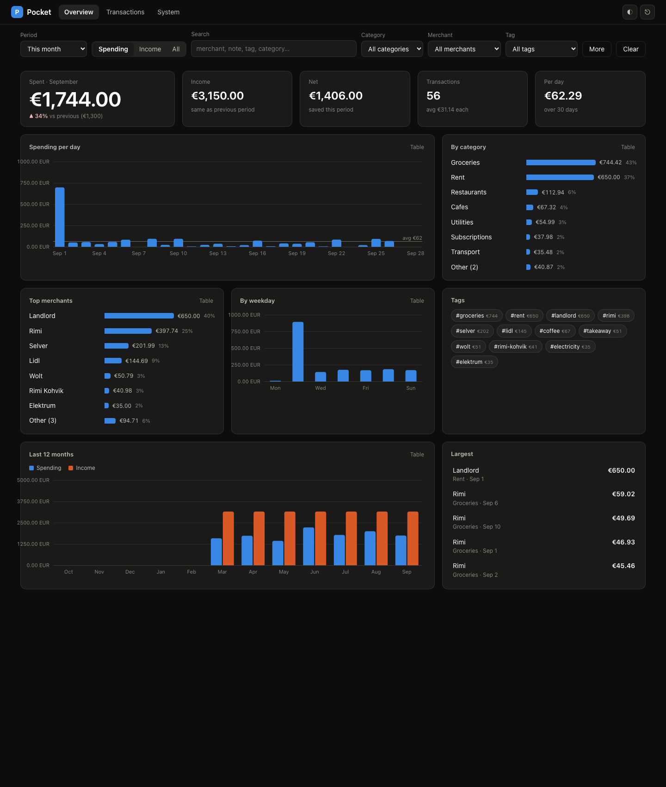
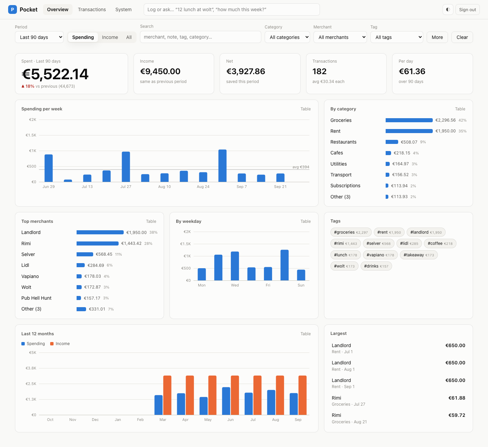
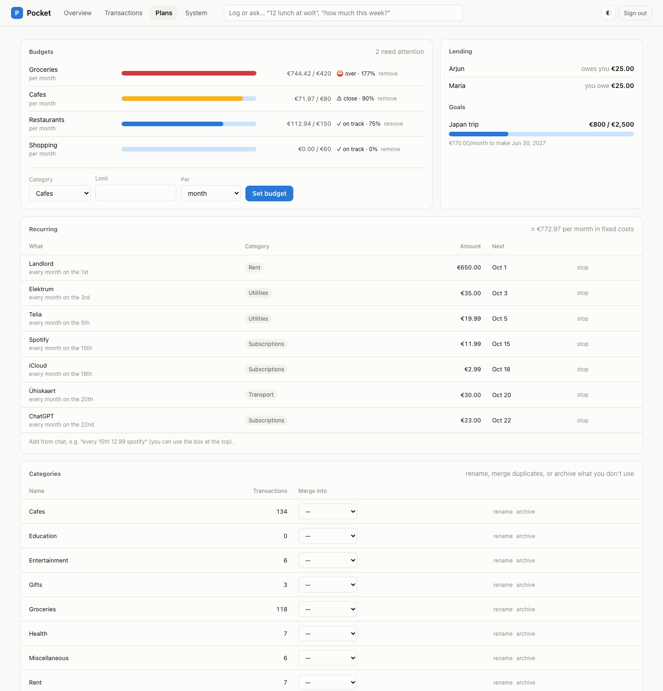
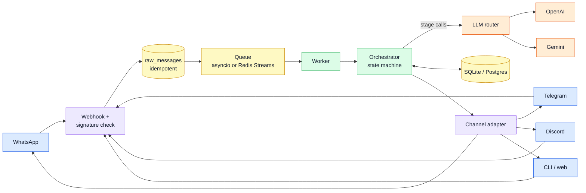

# Pocket

**A personal finance memory you talk to.** Text it the way you'd text a friend (on WhatsApp, Telegram, Discord or a terminal) and it extracts, categorizes, tags, converts currency and stores it. When it isn't sure, it asks first.

```
You   : 23 eur groceries at rimi today
Pocket: ✅ Logged €23.00 · Groceries · #rimi #groceries · Today 21:14
        (reply "undo" or "edit" within 5 min to change)
You   : sorry it was 29
Pocket: ✏️ Updated last transaction: €23.00 → €29.00
You   : coffee w/ arjun 6.50 and then metro 2
Pocket: Two transactions?
        1. €6.50 · Cafes · #coffee #arjun · with Arjun
        2. €2.00 · Transport · #metro
        Reply "yes" to save both, "1" or "2" to save one, or tell me what's off.
You   : chiya 30 rupees aja
Pocket: ✅ Logged ₨30.00 (~€0.17) · Cafes · #chiya · Today 21:16
        Base currency EUR; NPR converted at 174.82, ECB 2026-09-25.
You   : kati kharcha bhayo yo hapta grocery ma?
Pocket: This week (so far) · Groceries: €29.00 spent across 1 transaction.
```



<p>
  
  
</p>

## What makes it more than a prompt

- **A staged LLM pipeline, not one prompt.** Intent → extraction (structured JSON schema) → categorization → policy. Each stage is small, testable and has its own model chain. Anything deterministic (undo, edit 2 amount 29, show week, budgets) never touches a model.
- **Vendor-agnostic routing.** OpenAI → Gemini per stage, via LiteLLM (one setting, `POCKET_LLM_PROVIDER_ORDER=gemini,openai`, flips the priority everywhere). Fallback triggers on rate limits, timeouts, 5xx, context overflow and **schema-validation failures** (retry once, then move on). Models near their free-tier quota are skipped before they 429. There's a daily $ cap.
- **Provider outages don't lose messages.** If every model is down, the message is already saved; the user is told, and a background job retries it.
- **The LLM proposes; the system confirms.** Deterministic guards check every extraction (an explicit "£"/"₹"/"npr" in the text beats the model's currency; an amount that isn't in the message forces a confirmation), plus confidence gating, novel-category confirmation (no category explosion), duplicate detection, multi-transaction confirmation.
- **Nothing is lost or silently overwritten.** Every inbound message is persisted before processing (idempotent on the provider's message id, so webhook retries can't double-log). Every edit writes a version row. Deletes are soft. Undo is exact.
- **Debuggable.** Every LLM call is logged with request/response, tokens, latency and cost. `/admin/replay/<id>` re-runs any stored message as a dry run. JSON logs have one line per message with the pipeline stages.

## Features

| | |
|---|---|
| Channels | WhatsApp (Twilio), Telegram (webhook + inline keyboards), Discord (interactions + buttons), CLI/HTTP |
| Input | free text in English/Nepali, receipt photos (vision), voice notes (transcription), location pins → city tag |
| Money | integer minor units, multi-currency with base-currency conversion (ECB via frankfurter, NPR via the INR peg, fallbacks) |
| Fixing things | `undo`, `edit`, `edit 2 amount 29`, "make that groceries", `delete 3`, "delete the coffee one", `history 1` |
| Questions | "how much grocery this month?", "top merchants last month", "average weekday coffee spend", "breakdown by category", "how much with arjun this year" |
| Extras | budgets with 80% nudges, recurring transactions ("every 15th 12.99 spotify"), lending tracker ("lent 20 to arjun", `owes`), group splits ("split 60 dinner with arjun and sita"), savings goals ("goal japan 2000 by march", "save 200 japan"), person profiles, "unusually large" nudges, weekly digest, exports (CSV/JSON/QIF), category management |
| Dashboard | overview charts, filters (period, direction, category, merchant, tag, search, amount range, currency), transactions table with edit drawer + full history, plans (budget meters, recurring, lending), LLM cost & health, a quick-log box that runs the same pipeline, installable as a PWA |
| Ops | health/readiness checks, per-user rate limits, cost cap, nightly backups (+ Azure Blob), Redis Streams workers, Docker Compose + Caddy, CI |

## How well does it parse?

`pocket eval` runs a golden set and a held-out set against each model alone ([full report](docs/eval.md)):

| held-out (26 msgs) | intent | extraction | category | p50 | p95 | list cost |
|---|---|---|---|---|---|---|
| `gpt-4o-mini` (primary) | 100% | 100% | 88% | 1.2 s | 2.0 s | $0.006 |
| `gemini-flash-lite-latest` (fallback) | 100% | 100% | 93% | 1.2 s | 14.9 s | $0.015 (free tier) |

## Quickstart (local, 2 minutes)

```bash
uv sync
echo "OPENAI_API_KEY=sk-..." >> .env   # and/or GEMINI_API_KEY
uv run pocket chat              # talk to it in the terminal
```

At least one of `OPENAI_API_KEY` / `GEMINI_API_KEY` is required (see `.env.example`). Then:

```bash
uv run pocket demo --months 6   # optional: realistic fake history
POCKET_ADMIN_TOKEN=dev uv run pocket serve
open "http://localhost:8080/app?token=dev"
```

## Talking to it

| Say | What happens |
|---|---|
| `12.50 lunch at wolt` | logged (category from your merchant history or the LLM) |
| `coffee 4 and metro 2` | asks to confirm both, or pick `1`/`2` |
| `sorry it was 29` / `make that groceries` | edits the last one (or whichever you describe) |
| `undo` (`u`) | reverts the last add/edit/delete, within 5 min |
| `edit` (`e`) · `edit 2 amount 29` · `delete 3` | numbered recent list, direct edits |
| `how much this week?` · `top merchants september` | natural-language queries |
| `show today` · `show month` | quick lists |
| `budget cafes 80` · `budgets` | soft monthly limits |
| `every 15th 12.99 spotify` · `recurring` | recurring transactions |
| `lent 20 to arjun` · `owes` · `person arjun` | lending balances, people profiles |
| `split 60 dinner with arjun and sita` | your share as an expense, the rest as loans |
| `goal japan 2000 by march` · `save 200 japan` · `goals` | savings goals with the monthly amount needed |
| `export csv month` | signed download link |
| `categories` · `category rename X to Y` · `category merge X into Y` | category admin |
| `cost` · `review` · `digest` · `currency npr` · `tz Europe/Lisbon` | the rest (`help` lists everything) |

## Architecture



The orchestrator is deliberately **not an agent**. It's a plain state machine: pending answer? → deterministic command? → intent → stage → policy → side effect. The LLM is consulted only where language understanding is needed. **Full documentation, with diagrams: [docs/](docs/README.md)** (overview → life of a message → orchestrator → LLM layer → data model → features → channels → dashboard → operations). The short "as built vs. design doc" summary is [docs/ARCHITECTURE.md](docs/ARCHITECTURE.md); what's next is in [ROADMAP.md](ROADMAP.md).

```
src/pocket/
  channels/   whatsapp · telegram · discord · cli adapters (normalize in, render out)
  api/        webhooks · admin (replay, cost) · health
  core/       orchestrator · policy · commands · session · queue · ingest · dispatch
  llm/        router (fallback chains) · stages · prompts/*.md · schemas · guards
  data/       models · repositories · alembic migrations
  services/   fx · queries · budgets · recurring · lending · digests · exports · backups · media
  web/        dashboard (JSON API + static SPA, no build step)
```

## Running it with real chat apps (local)

```bash
make dev    # = ./scripts/dev.sh
```

It starts (or reuses) an ngrok tunnel to :8080, writes the URL into `.env` as `POCKET_PUBLIC_URL`, starts the server, re-points your Discord app's Interactions Endpoint and the Telegram webhook at the tunnel, then follows the log. Ctrl-C stops it. Run it again whenever the ngrok URL changes.

## Channels setup

**WhatsApp (Twilio sandbox).** Join the sandbox from your phone and set the sandbox's *When a message comes in* URL to `https://<host>/webhook/whatsapp`. Fill `POCKET_TWILIO_*` and `POCKET_OWNER_WHATSAPP=whatsapp:+<your number>`. `POCKET_PUBLIC_URL` must match the URL Twilio calls, because it's part of the signature.

**Telegram.** Create a bot with @BotFather and set `POCKET_TELEGRAM_BOT_TOKEN` and a random `POCKET_TELEGRAM_WEBHOOK_SECRET`, then run `pocket telegram-webhook`. Send the bot a message, find your chat id in `/admin`, and `pocket link telegram:<chat id>`.

**Discord.** Create an application and set its *Interactions Endpoint URL* to `https://<host>/webhook/discord`. Fill `POCKET_DISCORD_*`, then run `pocket discord-commands`. Use `/pocket text:23 eur lunch` and `/receipt`.

Anyone not on the allowlist gets silence. There is no login flow; the channel identity is the auth.

## Coming from Pocket v1

```bash
scp vm:/path/to/pocket-ai/data/pocket.db ./v1.db
uv run pocket import-v1 v1.db --currency NPR          # dry run: shows what would be imported
uv run pocket import-v1 v1.db --currency NPR --apply  # idempotent, safe to re-run
```

Expenses keep their original message text, v1 budgets become monthly budgets,
and lendings become `lent`/`got_back` entries, so `owes` works immediately.

## Deploy

```bash
cp .env.example .env    # fill it in
docker compose up -d    # api + worker + redis + caddy (auto TLS for POCKET_DOMAIN)
```

Migrations run at container start. Data (SQLite, backups, exports) lives in `./data`. CI (`.github/workflows/ci.yml`) runs lint, mypy, tests and migrations, builds and pushes the image to GHCR, and can SSH-deploy.

## Development

```bash
uv run pytest            # ~140 tests, no network needed (a stub LLM stands in)
uv run pytest -m live    # golden set against the real LLM chain (needs keys)
uv run ruff check src tests && uv run mypy src
```

Tests run against a scripted **stub LLM** (`tests/support/stub_llm/`, test-only, never used by the app) and a **chaos backend** that randomly fails, returns malformed JSON, rate-limits and times out, to exercise the fallback paths. `tests/fixtures/messages.jsonl` is the golden set of messages and expected parses.
