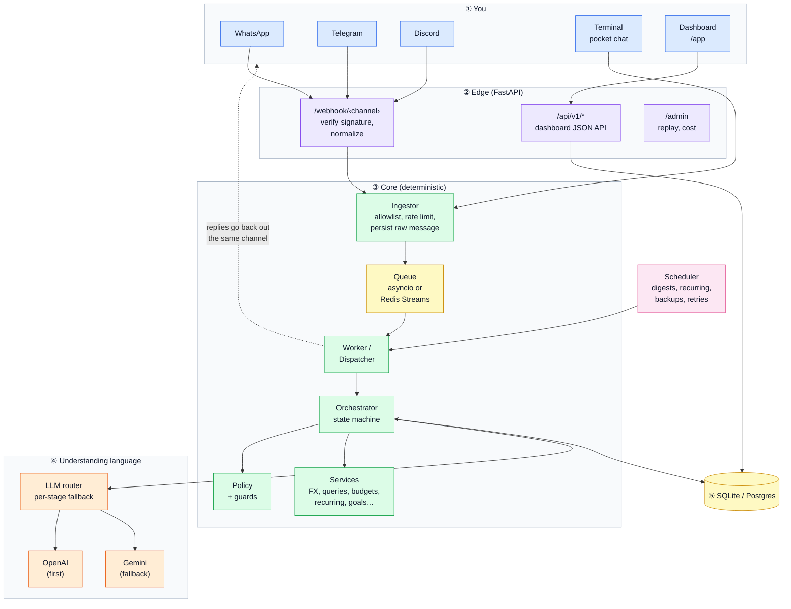
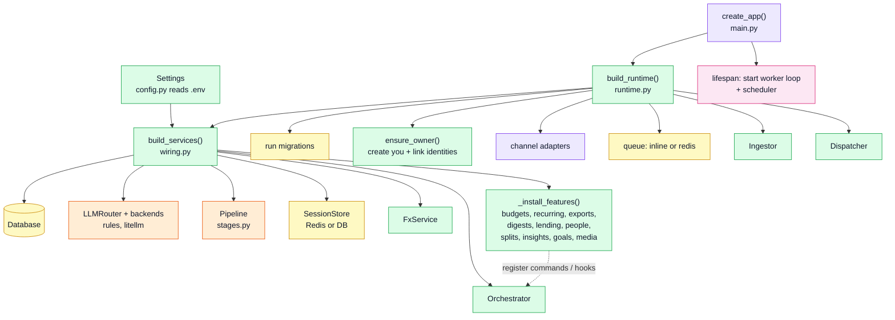

# 1. Overview

## What Pocket is

A personal finance log you talk to. You text it like a friend, on WhatsApp, Telegram, Discord, the terminal or the dashboard's quick-log box, and it:

1. **understands** the message ("23 eur groceries at rimi today", "chiya 30 rs aja", "sorry it was 29"),
2. **structures** it into a transaction (amount in minor units, currency, category, merchant, tags, date),
3. **checks** it (duplicate? new category? unsure?) and asks you when it needs to,
4. **stores** it in your own database, with the raw message and every later edit kept,
5. **answers questions** ("how much on food this month?") and shows everything on a dashboard.

It is single-user by design (you), but nothing in the schema stops more users later.

## The big picture



Read it left to right:

- **Channels** (blue) deliver your message to a webhook. Twilio calls `/webhook/whatsapp`, Telegram calls `/webhook/telegram/<secret>`, and so on.
- **The edge** (purple) proves the request really came from that platform (signature check) and turns it into one common shape, `InboundMessage`.
- **The ingestor** checks you're on the allowlist, saves the raw message to the DB *before doing anything else*, and puts its id on a queue. The webhook returns 200 immediately.
- **The worker** picks the id off the queue and hands it to the **orchestrator**, the brain. It decides what the message is and what to do about it.
- The orchestrator calls the **LLM router** only where language understanding is needed. The router tries OpenAI first, then Gemini, per stage (`POCKET_LLM_PROVIDER_ORDER` flips that).
- **Policy and guards** (green) are plain Python that decide whether to save, ask, or refuse. The LLM never writes to the database directly.
- The reply goes back out through the same channel adapter.

## Principles you'll see everywhere in the code

| Principle | Where it shows up |
|---|---|
| **Persist first, process second.** | `core/ingest.py` saves `raw_messages` before queueing. If every LLM is down, the message waits and is retried (`services/scheduler.py: reprocess_stuck`). |
| **The LLM proposes; the system confirms.** | `llm/guards.py`, `core/policy.py`. Low confidence, new categories, duplicates and multi-item messages all ask first. |
| **Nothing is silently overwritten.** | Every edit writes a `transaction_versions` row; deletes are soft (`deleted_at`); undo reverses exact versions. |
| **The channel is a detail.** | The orchestrator only sees `InboundMessage` / `OutboundMessage` (`channels/base.py`). |
| **Deterministic where possible.** | Commands (`undo`, `edit 2 amount 29`, `budgets`...) never touch an LLM. Categorization tries merchant history and name matching before asking a model. |
| **Money is integers.** | `amount_minor` (cents). Conversions happen once, at write time (`core/money.py`). |

## Repository map

```text
PocketAI/
├── src/pocket/
│   ├── main.py              FastAPI app factory (routes, lifespan)
│   ├── runtime.py           builds adapters + queue + ingestor + dispatcher; starts worker/scheduler
│   ├── wiring.py            builds the object graph from settings (DB, router, pipeline, orchestrator, features)
│   ├── config.py            every setting (env vars, POCKET_ prefix)
│   ├── cli.py               the `pocket` command (chat, serve, worker, demo, eval, import-v1, ...)
│   ├── logging_setup.py     JSON logs in prod, readable ones in dev
│   │
│   ├── channels/            one file per chat app: parse inbound, verify, send outbound
│   │   ├── base.py          InboundMessage / OutboundMessage / Option: the shared shapes
│   │   ├── whatsapp.py      Twilio: signature, form parsing, REST send
│   │   ├── telegram.py      Bot API: secret check, update parsing, inline keyboards
│   │   ├── discord.py       Interactions: Ed25519 verify, slash commands, buttons
│   │   └── cli.py           in-memory outbox for the terminal and /webhook/cli
│   │
│   ├── api/                 HTTP endpoints that aren't the dashboard
│   │   ├── webhooks.py      POST /webhook/{whatsapp,telegram,discord,cli}
│   │   ├── admin.py         /admin: messages, replay, cost, quota, reload, reprocess
│   │   └── health.py        /healthz, /readyz
│   │
│   ├── core/                the deterministic heart
│   │   ├── orchestrator.py  the state machine (read doc 3)
│   │   ├── commands.py      regex command parser (no LLM)
│   │   ├── policy.py        Proposal + decide_add(): commit / ask / confirm category / duplicate
│   │   ├── extras.py        secondary commands: categories, cost, settings, review, history
│   │   ├── ingest.py        allowlist + rate limit + idempotent persist + enqueue
│   │   ├── queue.py         InlineQueue (asyncio) / RedisStreamQueue
│   │   ├── dispatch.py      worker side: run orchestrator, send replies, proactive sends
│   │   ├── session.py       short-lived state for undo and numbered lists (Redis or DB)
│   │   ├── normalize.py     stage 0: unicode, signatures, Devanagari digits
│   │   ├── categorize.py    map a category name onto your categories (exact / plural / typo)
│   │   ├── dates.py         "yesterday", "aja", "last friday", period ranges in your timezone
│   │   ├── money.py         minor units, formatting, conversion
│   │   ├── directions.py    expense/income/transfer + lending directions
│   │   ├── render.py        every user-facing string (receipts, help, errors)
│   │   ├── calllog.py       buffers llm_calls rows per message
│   │   └── ratelimit.py     sliding-window limiter
│   │
│   ├── llm/                 everything that talks to a model
│   │   ├── router.py        fallback chains, retries, quota skip, cost cap
│   │   ├── stages.py        Pipeline: intent / extract / categorize / edit / delete / query / receipt / summarize
│   │   ├── schemas.py       pydantic models the LLM must fill (structured output)
│   │   ├── guards.py        deterministic checks on LLM output (currency, amount)
│   │   ├── quota.py         free-tier request counters
│   │   ├── cache.py         prompt assembly for provider-side prompt caching
│   │   ├── prompts/*.md     the prompts, one per stage
│   │   └── backends/        litellm_backend.py (real models), fake.py (tests, chaos)
│   │
│   ├── data/
│   │   ├── models.py        SQLAlchemy tables (read doc 5)
│   │   ├── repositories.py  query helpers per table
│   │   ├── db.py            engine, session factory, UTC datetime type
│   │   ├── migrate.py       programmatic alembic upgrade
│   │   └── migrations/      alembic versions
│   │
│   ├── services/            features and integrations (read doc 6)
│   │   ├── fx.py            exchange rates: ECB → NPR via INR peg → open.er-api → static table
│   │   ├── queries.py       runs a QueryPlan against the DB
│   │   ├── budgets.py  recurring.py  lending.py  splits.py  goals.py  people.py  insights.py
│   │   ├── digests.py       weekly + monthly recap
│   │   ├── exports.py       CSV / JSON / QIF + signed download links
│   │   ├── media.py         receipt photos (vision) + voice notes (transcription)
│   │   ├── backups.py       sqlite backup + rotation + Azure Blob upload
│   │   ├── scheduler.py     APScheduler jobs
│   │   ├── import_v1.py     bring history over from the v1 Telegram bot
│   │   ├── evaluate.py      the model benchmark (pocket eval)
│   │   ├── demo.py          fake history for the dashboard
│   │   └── geo.py           location pin → city name
│   │
│   └── web/                 the dashboard (read doc 8)
│       ├── api.py           /api/v1/* JSON endpoints
│       ├── auth.py          token → signed cookie
│       ├── dashboard.py     /app routes, login page, static files
│       └── static/          index.html, app.js, app.css, manifest (no build step)
│
├── config/llm.yaml          model chains per stage, quotas (llm.local.yaml for Ollama)
├── tests/                   unit/, integration/, replay/ (live), fixtures/*.jsonl, support/stub_llm (test-only stand-in model)
├── docs/                    you are here
├── Dockerfile  docker-compose.yml  deploy/  .github/workflows/ci.yml
└── Makefile  pyproject.toml  alembic.ini  .env.example  ROADMAP.md
```

## How the pieces are assembled at startup



Features plug themselves in. Each `services/*.py` module has an `install(services)` function that registers chat commands (`orchestrator.extra_commands`), after-save hooks (`orchestrator.after_commit`) or the media handler. The orchestrator itself doesn't import budgets or goals. That's why `core/orchestrator.py` stays about the main flow.

Next: [2. Life of a message](02-message-lifecycle.md)
