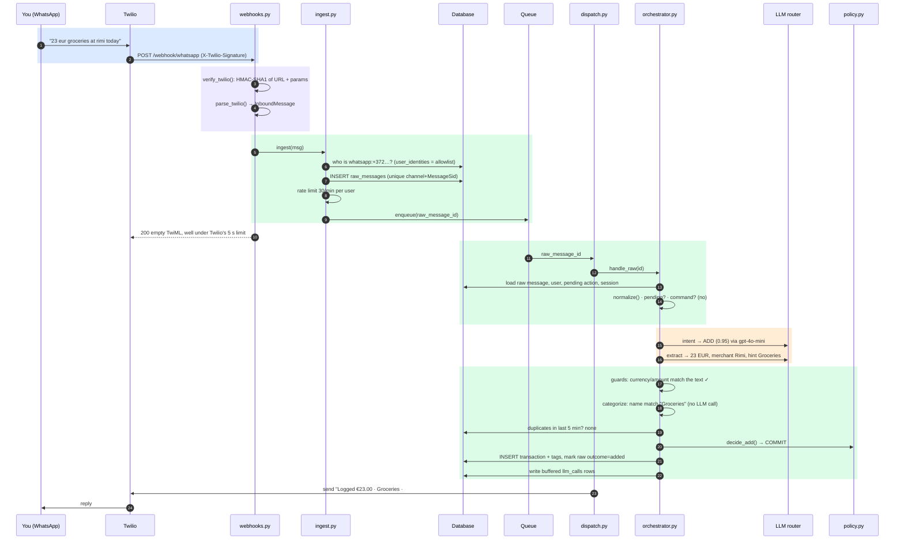
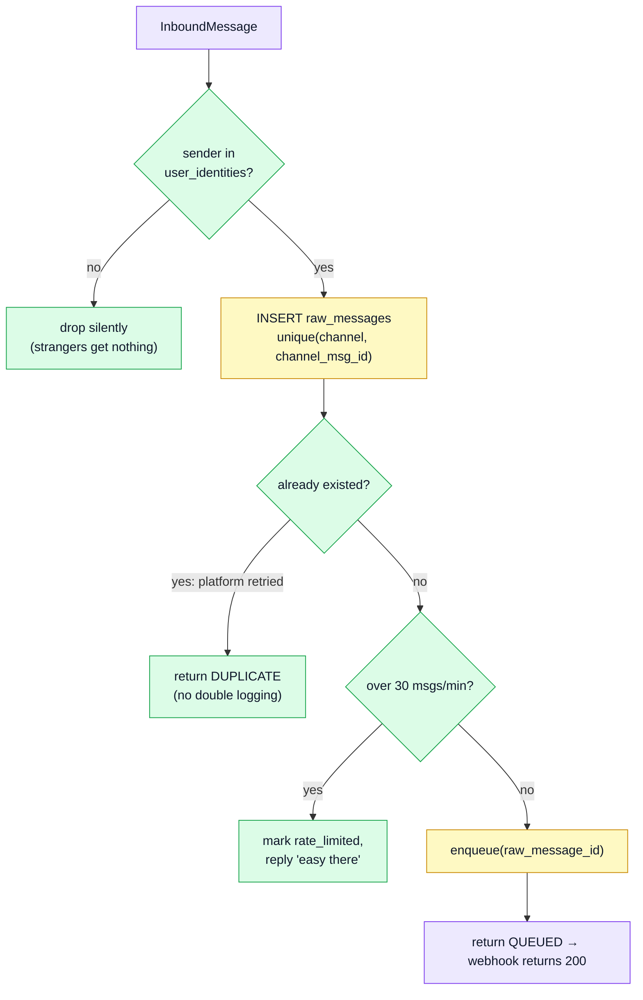
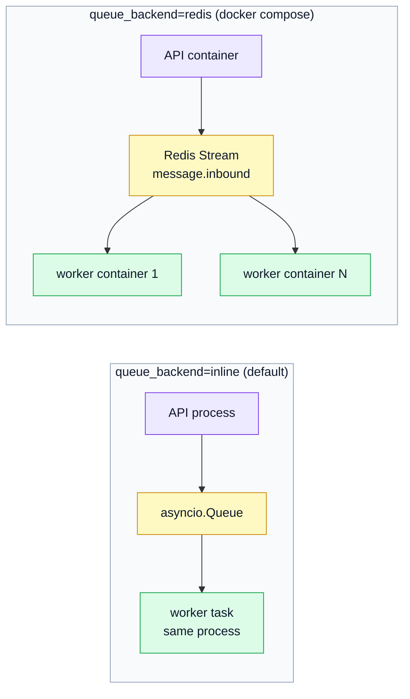
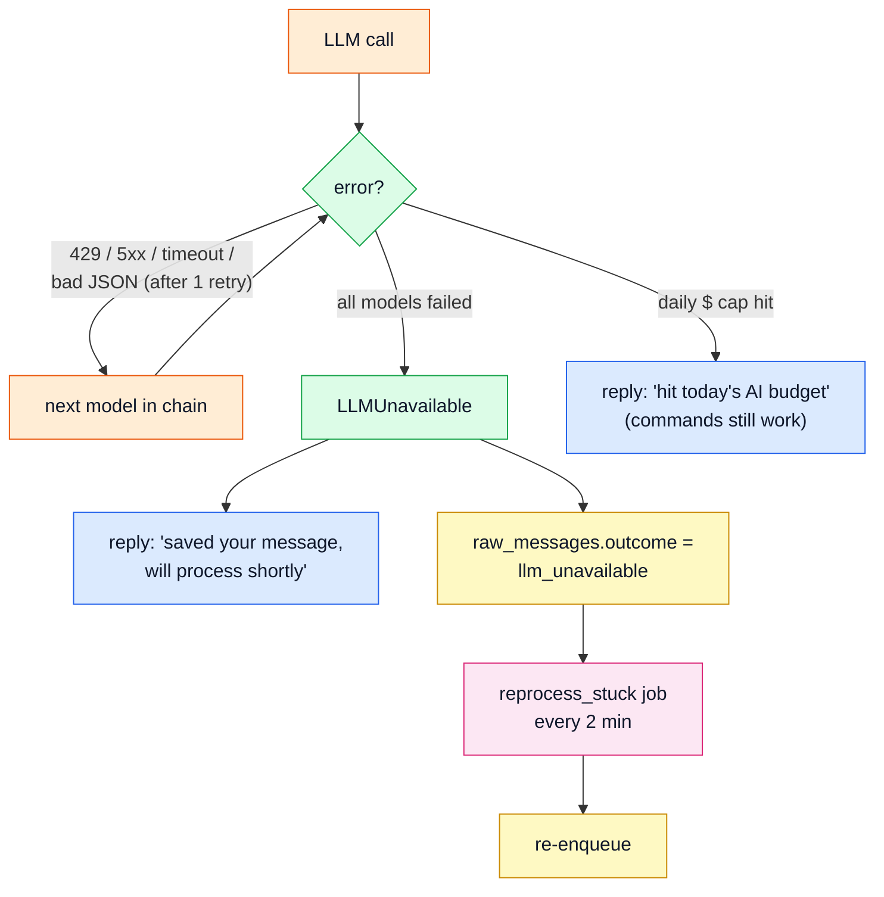

# 2. Life of a message

We'll follow one real message, **"23 eur groceries at rimi today"** sent on WhatsApp, from your phone to the ✅ reply, naming the file and function at every step.

## The whole trip



Colored bands: 🟦 your phone/Twilio, 🟪 the edge, 🟩 deterministic code, 🟧 LLM calls.

## Step by step

### 1. The webhook (`api/webhooks.py`)

Each channel has its own endpoint, because each platform proves authenticity differently:

| Channel | Endpoint | How the request is verified |
|---|---|---|
| WhatsApp | `POST /webhook/whatsapp` | `X-Twilio-Signature` = base64(HMAC-SHA1(auth token, public URL + sorted params)) |
| Telegram | `POST /webhook/telegram/<secret>` | secret in the path, or the `X-Telegram-Bot-Api-Secret-Token` header |
| Discord | `POST /webhook/discord` | Ed25519 signature over timestamp + body with the app's public key |
| CLI/HTTP | `POST /webhook/cli` | `Authorization: Bearer <POCKET_ADMIN_TOKEN>` |

A bad signature gets a 403 (401 for Discord, as Discord requires). Signature checks fail *closed*: with `verify_signatures` on and no auth token configured, every request is rejected.

The adapter's parser (`parse_twilio`, `parse_update`, `parse_interaction`) turns the platform payload into an **`InboundMessage`** (`channels/base.py`):

```text
channel          "whatsapp"
channel_msg_id   "SM8f…"            ← the platform's message id: the idempotency key
user_channel_id  "whatsapp:+3725…"  ← who sent it
text             "23 eur groceries at rimi today"
media            [photos / voice notes with fetch URLs]
location         lat/lon if you shared a pin
meta             anything needed to reply (Discord interaction token, Telegram callback id)
```

### 2. Ingest: persist before anything else (`core/ingest.py`)



Why this matters:
- **Idempotency.** Twilio retries any webhook that doesn't return 200 quickly. The unique `(channel, channel_msg_id)` constraint means a retry finds the existing row and nothing is logged twice.
- **No lost input.** Once the row exists, the message survives crashes, restarts and provider outages. The worker always re-reads the message *from the DB*; the queue only carries the id.
- **The allowlist is the auth.** There's no login for chat. If your channel id isn't in `user_identities`, the message is dropped without a reply. `ensure_owner()` fills that table from `POCKET_OWNER_WHATSAPP` / `_TELEGRAM` / `_DISCORD` at startup, and `pocket link telegram:<chat id>` adds more.

### 3. The queue (`core/queue.py`)

Two implementations of the same two-method interface (`enqueue`, `run`):



- **Inline** is right for one user: zero extra services.
- **Redis Streams** uses a consumer group, so several workers can share the load. A message is only `XACK`ed after it's handled; if a worker dies mid-message, another reclaims it with `XAUTOCLAIM` after 60 s.

### 4. The dispatcher (`core/dispatch.py`)

`Dispatcher.process(raw_message_id)` calls `orchestrator.handle_raw(id)`, gets back a list of `OutboundMessage`s, looks up which channel and user the raw message came from, and sends each reply through that channel's adapter. Sends retry 3 times with backoff.

It also has `send_to_user(user_id, message)` for **proactive** messages (weekly digest, recurring notices). That tries your primary channel first and falls through to other linked channels. WhatsApp only allows free-form messages within 24 h of your last message, so a Sunday digest can bounce there and still arrive on Telegram.

### 5. The orchestrator

This is where the thinking happens. It gets its own doc: [3. The orchestrator](03-orchestrator.md). In short:

1. **normalize** the text,
2. if a **question is pending** ("Save both?"), treat the message as the answer,
3. else if it's a **command** (`undo`, `edit 2 amount 29`, `budgets`), run it with no LLM,
4. else classify the **intent** with the LLM and run the matching stage,
5. hand any proposed transaction to **policy**, then commit or ask.

### 6. Bookkeeping after every message

Whatever happened, `handle_raw` finishes by:
- setting `raw_messages.processed_at` and `.outcome` (`added`, `edited`, `query`, `pending`, `chitchat`, `llm_unavailable`, …),
- writing all buffered `llm_calls` rows (model, tokens, latency, cost, request/response) in one go,
- saving session state (for undo) only **after** the DB commit, so it never points at rolled-back rows,
- logging one JSON line: `{"event": "message_handled", "msg_id", "latency_ms", "llm_calls", "cost_usd", "stages": [...], "outcome"}`.

## When things go wrong



With two providers (OpenAI, then Gemini) both have to be down at once for this to happen. Even then nothing is lost: the message waits in `raw_messages` and is processed when a provider is back. Commands (`undo`, `edit 2 amount 29`, `budgets`) never need a model, so they keep working throughout.

Next: [3. The orchestrator](03-orchestrator.md)
