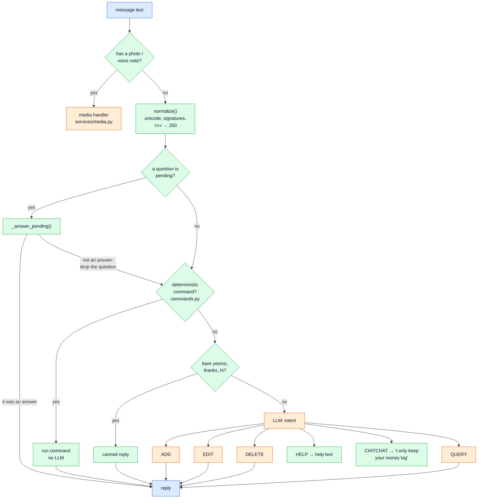
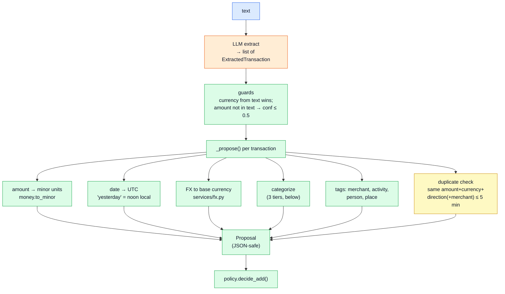
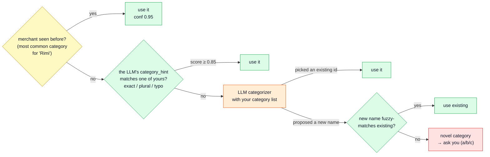
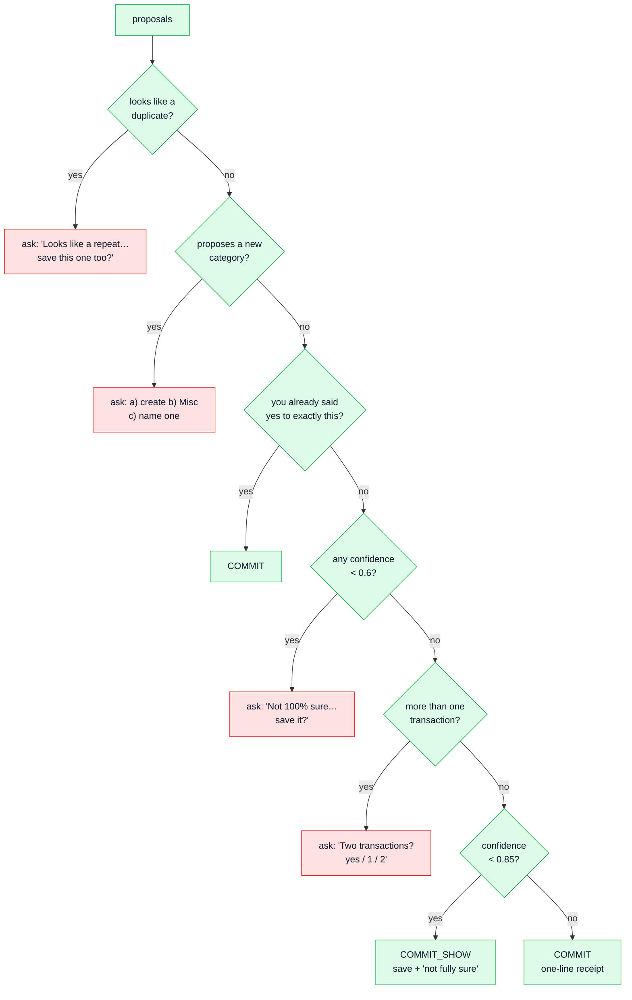
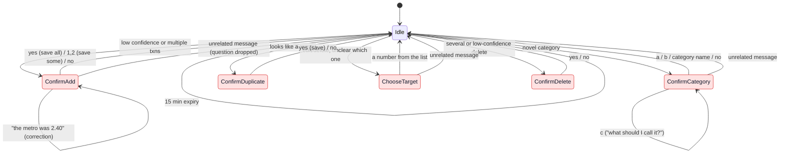
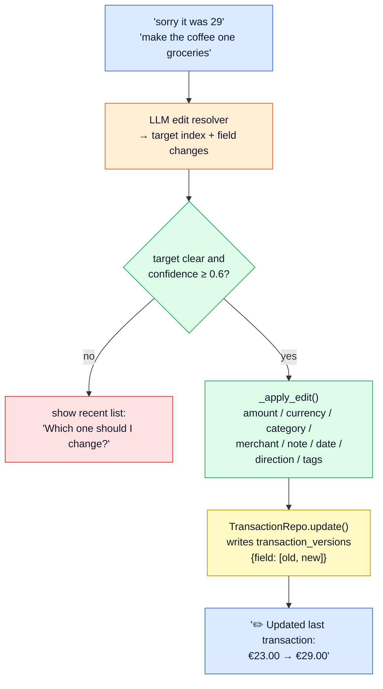
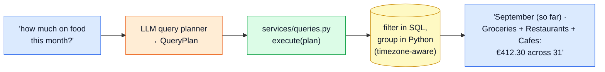

# 3. The orchestrator

`src/pocket/core/orchestrator.py` is the brain. It's deliberately **not an AI agent**: no "the model decides which tool to call". It's a plain state machine where the LLM is asked narrow questions ("what's the intent?", "extract the transactions") and **code** decides what happens. You can put a breakpoint anywhere and see exactly why something happened.

## The Turn

Every message is handled inside a `Turn`, a small object holding everything about this one message:

| field | what |
|---|---|
| `s` | the SQLAlchemy session: one DB transaction for the whole message |
| `user` | you (base currency, timezone) |
| `session` | short-lived state: recent transaction ids, the list you were last shown, the last action (for undo) |
| `now` | the clock (injectable, so tests can time-travel) |
| `stages` | a log of what happened (`intent`, `extract`, `categorize via=name_match`, `policy decision=commit`, …), which ends up in the JSON log and in `/admin/replay` output |
| `outcome` | the final label stored on the raw message (`added`, `edited`, `pending`, …) |

## Routing: what kind of message is this?



The order matters:
1. **Pending answers first.** If Pocket just asked "Two transactions? Reply yes…", then "yes" must mean *that*, not a new message.
2. **Commands second.** `undo`, `edit 2 amount 29`, `show week`, `budget cafes 80` are exact and free. They work during an LLM outage and after the daily cost cap.
3. **The LLM last**, only for real natural language.

## ADD: turning an extraction into a saved transaction



A **`Proposal`** (`core/policy.py`) is a transaction that hasn't been saved yet. It's JSON-serializable on purpose, so it can sit in the `pending_actions` table while Pocket waits for your "yes".

### Categorization: cheapest answer first



Most messages never need a separate categorizer call: the extractor already suggests a category from your list ("Groceries"), which is matched by name ("Grocery" and "Groceries" count as the same), and a known merchant goes wherever it went last time. New categories always need your OK, which stops "Grocery", "Groceries" and "Food shopping" from all existing at once.

### Policy: save, or ask?

`decide_add(proposals, thresholds)` in `core/policy.py`, checked top to bottom:



Confidence is the **minimum** across stages (extraction, categorization), not the product. Receipts and voice notes pass `force_confirm=True`, so they always ask. Thresholds live in settings (`POCKET_CONFIDENCE_COMMIT=0.85`, `POCKET_CONFIDENCE_ASK=0.6`).

After a commit, **after-commit hooks** run and can add lines to the reply: the budget nudge ("🟠 Cafes: €68 of €80 this month") and the unusual-amount nudge ("📈 about 12× your usual Cafes spend").

## Pending actions: the conversation's memory

When Pocket asks something, it stores a row in `pending_actions` (one per user, 15-minute expiry). Your next message is checked against it first.



Details worth knowing:
- **"Tell me what's off."** While a proposal is pending, a correction like "the metro was 2.40" runs the *edit resolver* against the unsaved proposals instead of saved transactions. Then Pocket asks again with the fix applied. It only does this if the intent classifier says EDIT; a brand-new expense ("lunch 12") drops the question and is logged normally.
- A reply to "a/b/c" that contains a number or a "?" is never taken as a category name.
- `no`, `cancel`, `hoina` always clear the pending question.

## EDIT and DELETE

Both work against a **numbered list** of recent transactions (1 = newest). If Pocket just showed you a list (`edit`, `review`, "which one?"), the numbers refer to that list; otherwise to your 5 most recently logged.



- Changing the amount of a foreign-currency transaction keeps its original FX rate; changing the currency fetches a fresh one.
- Editing to a category that doesn't exist creates it (you asked explicitly), marked "(new)".
- Deletes are soft (`deleted_at`), ask when ambiguous or when deleting several, and are reversible with `undo` or the dashboard's "Restore".
- Direct forms skip the LLM entirely: `edit 2 amount 29`, `edit last category groceries`, `delete 3`, `d 1,2`.

## Undo

`undo` (or `u`) reverses the **last transaction change** within 5 minutes:

| last action | undo does |
|---|---|
| add | soft-deletes what was added |
| edit | re-applies the *old* values from the exact version rows that edit wrote |
| delete | restores the rows |

Undo itself writes versions too, so the history shows everything. Any other state-changing command (setting a budget, creating a goal) clears the undo target, so `undo` never reaches back to an older, unrelated action. Read-only commands (`categories`, `budgets`, `goals`) keep it.

The undo target lives in the **session store** (`core/session.py`): Redis when configured, otherwise a `sessions` table. Either way it survives a restart.

## QUERY



The LLM never writes SQL. It fills a small typed **`QueryPlan`**:

```text
kind      total | count | average | daily_average | list | breakdown |
          top_merchants | top_categories | top_tags | largest
period    today | yesterday | this_week | last_week | this_month | last_month |
          this_year | last_year | last_7_days | last_30_days | all_time | custom
category / categories   one, or several for umbrella words ("food", "bills")
merchant, tag           person tags too: "with arjun"
direction               expense | income | any
group_by                category | merchant | tag | day | weekday | month
weekdays_only / weekends_only, limit
```

The executor turns that into SQL filters and formats the answer itself, so numbers can't be hallucinated. Queries are rate-limited to 5/min.

Next: [4. The LLM layer](04-llm-layer.md)
