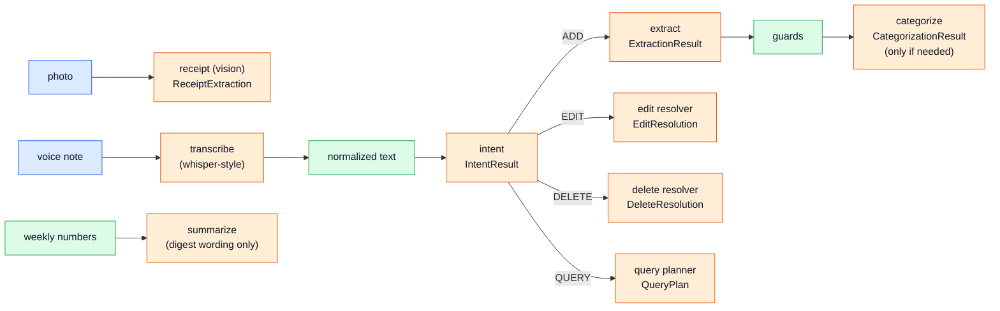
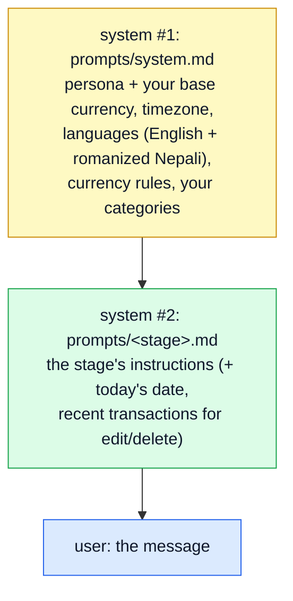
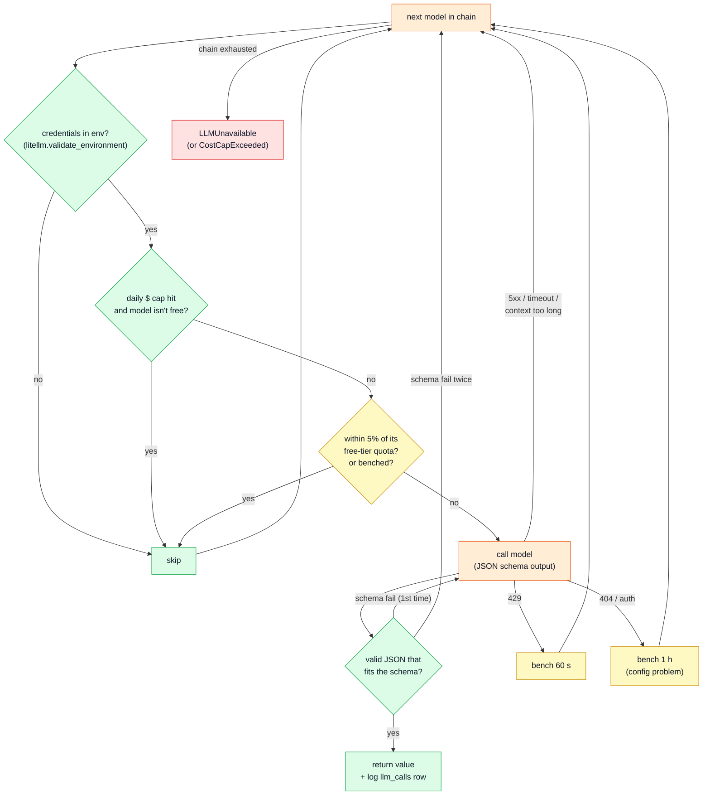
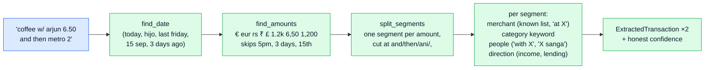

# 4. The LLM layer

Everything that talks to a model lives in `src/pocket/llm/`. Three ideas:

1. **Stages, not one prompt.** Each stage asks one narrow question and gets back a typed pydantic object.
2. **Every stage has a fallback chain.** Gemini → OpenAI → the offline rules parser, per stage, with explicit failover rules.
3. **Model output is a proposal.** Deterministic guards and the policy layer decide what's actually saved.

## The stages



| Stage | Pipeline method | Returns (`llm/schemas.py`) | Prompt |
|---|---|---|---|
| intent | `Pipeline.intent` | `IntentResult{intent: ADD/EDIT/DELETE/QUERY/HELP/CHITCHAT, confidence}` | `prompts/intent.md` |
| extract | `Pipeline.extract` | `ExtractionResult{transactions: [ExtractedTransaction]}`: amount, currency, direction, merchant, category_hint, tags(+kind), occurred_at, note, confidence, reasoning | `prompts/extract.md` |
| categorize | `Pipeline.categorize` | `CategorizationResult{category_id \| new_category_name, confidence}` | `prompts/categorize.md` |
| edit | `Pipeline.resolve_edit` | `EditResolution{target_index, changes: [{field, value}], confidence}` | `prompts/edit.md` |
| delete | `Pipeline.resolve_delete` | `DeleteResolution{target_indexes, confidence}` | `prompts/delete.md` |
| query | `Pipeline.plan_query` | `QueryPlan` (see doc 3) | `prompts/query.md` |
| receipt | `Pipeline.receipt` | `ReceiptExtraction{is_receipt, transaction}` | `prompts/receipt.md` |
| summarize | `Pipeline.summarize` | `Summary{text}` | `prompts/summarize.md` |

The schemas are deliberately **not** the database shape. `amount` is a float here and `amount_minor` an integer in the DB; the orchestrator maps one to the other. The DB never depends on what a model returns.

## Prompts and caching (`llm/cache.py`, `llm/prompts/*.md`)

Every request has the same three-part layout:



Part 1 is identical for every call from you on a given day. Providers cache a request's identical *prefix* (Gemini and OpenAI automatically; Anthropic when marked with `cache_control`, which `with_cache_control()` adds), so the big part is cheap after the first call. It's also memoized in-process by `SystemPromptCache`.

Prompts are plain markdown with `{{variables}}`. Change the wording there, never in Python.

## The router (`llm/router.py`)

`config/llm.yaml` maps each stage to a chain:

```yaml
router:
  fast:       { primary: gemini/gemini-flash-lite-latest, fallbacks: [xai/grok-4-fast, openai/gpt-4o-mini, rules/v1] }
  extractor:  { primary: gemini/gemini-flash-lite-latest, fallbacks: [openai/gpt-4o-mini, gemini/gemini-3.8-flash, xai/grok-4, rules/v1] }
  resolver:   { primary: gemini/gemini-flash-lite-latest, fallbacks: [openai/gpt-4o-mini, rules/v1] }
  query:      { primary: gemini/gemini-3.8-flash, fallbacks: [openai/gpt-4o-mini, gemini/gemini-flash-lite-latest, rules/v1] }
  vision:     { primary: gemini/gemini-3.8-flash, fallbacks: [openai/gpt-4o-mini] }
purposes: { intent: fast, extract: extractor, categorize: extractor, edit: resolver, delete: resolver, query: query, receipt: vision, summarize: summarizer }
quotas:   { gemini/gemini-3.8-flash: {rpm: 10, rpd: 250}, gemini/gemini-flash-lite-latest: {rpm: 15, rpd: 1000} }
```

`router.structured(purpose, prompt, Schema)` walks the chain:



**Backends** are picked by model prefix: `rules/*` → the offline parser, `fake/*` → the test double, anything else → `LiteLLMBackend` (Gemini, OpenAI, xAI, Anthropic, Ollama all speak through LiteLLM). A backend with `free = True` (rules, fake) keeps working after the daily cost cap.

**Why not LiteLLM's own Router?** The failover rules are specific (retry once only on schema failure, bench models that 404, respect quotas before calling, logging per attempt), and they're easier to test when written out.

**Quota tracking** (`llm/quota.py`) counts requests per model per minute and per day, in Redis when available (so the API and workers share counts) or in memory otherwise.

**Cost cap:** `DailyCostGuard` in `wiring.py` sums today's `llm_calls.cost_usd` (cached 5 s) and flips the router into free-only mode at `POCKET_LLM_DAILY_COST_CAP_USD` (default $1).

## Guards (`llm/guards.py`)

Cheap deterministic checks on every extraction, before policy sees it:

| guard | rule | why |
|---|---|---|
| `currency_guard` | if the text has an explicit currency next to an amount ("£8", "₹450", "30 npr"), that currency wins | the benchmark caught models reading ₹ as NPR and £ as EUR |
| `amount_guard` | if the text has digits but a proposed amount isn't one of them, cap confidence at 0.5 | a hallucinated number then triggers "Save it?" instead of being saved |

## The offline parser (`llm/rules/`)

`rules/v1` is a real backend that fills the same schemas deterministically. It's the last fallback in every text chain and the only model when no keys are set.



- `lexicon.py` holds the word lists: currency words (including रु, rupiya, bucks), category keywords (Rimi → Groceries, chiya → Cafes, momo → Restaurants…), known merchants, weekdays/months in English and Nepali, income and lending verbs.
- `parser.py` has one function per stage: `classify_intent`, `extract`, `categorize`, `resolve_edit`, `resolve_delete`, `plan_query`.
- Its confidence is honest: no category keyword → −0.25; bare number with nothing else ("12") → another −0.25. So uncertain parses ask for confirmation.

## Measuring it: `pocket eval` (`services/evaluate.py`)

Runs two message sets against each model on its own:

- `tests/fixtures/messages.jsonl`, the **golden set**, which the rules parser was developed against,
- `tests/fixtures/holdout.jsonl`, the **held-out set**, written afterwards and never tuned on (except one real bug it caught).

It paces calls to each model's free-tier rpm, retries 429/503s, counts provider errors separately from wrong answers, and gives up on a model after 5 errors in a row. Results: [eval.md](eval.md). On the held-out set, flash-lite and gpt-4o-mini both scored 100% on intent and extraction.

`pytest -m live` runs the golden set through the **full chain** (what production uses) as a regression test.

## Tests without models

`llm/backends/fake.py` has:
- `FakeBackend`: queue exact responses per stage (`fake.queue("categorize", {...})`) to script a conversation,
- `BrokenBackend`: always fails, to test fallthrough,
- `ChaosBackend`: randomly returns 503, 429, timeouts and malformed JSON around a real backend. The router tests run 20 chaotic calls and require every one to land.

Next: [5. Data model](05-data-model.md)
