# 5. Data model

Tables are defined in `src/pocket/data/models.py` and migrated with Alembic (`src/pocket/data/migrations/`). Everything runs identically on SQLite (default) and Postgres; CI runs the integration suite on both.

## Entity relationships

```mermaid
erDiagram
  users ||--o{ user_identities : "reachable at"
  users ||--o{ categories : owns
  users ||--o{ tags : owns
  users ||--o{ transactions : has
  users ||--o{ raw_messages : sent
  users ||--o| pending_actions : "0 or 1 open"
  users ||--o| sessions : "short-lived state"
  users ||--o{ budgets : sets
  users ||--o{ recurring_rules : schedules
  users ||--o{ goals : saves
  categories ||--o{ categories : "parent of"
  categories ||--o{ transactions : classifies
  categories ||--o{ budgets : "limited by"
  transactions }o--o{ tags : "transaction_tags"
  transactions ||--o{ transaction_versions : "history"
  raw_messages ||--o{ transactions : "parsed into"
  raw_messages ||--o{ llm_calls : "cost of"
  users ||--o{ imports : uploads
  imports ||--o{ import_rows : "staged rows"
  imports ||--o{ transactions : "created"

  users {
    int id PK
    string base_currency "EUR"
    string timezone "Europe/Tallinn"
    string primary_channel "where digests go"
  }
  user_identities {
    int id PK
    int user_id FK
    string channel "whatsapp, telegram, discord, cli, web"
    string channel_user_id "unique with channel: THE allowlist"
  }
  transactions {
    int id PK
    int amount_minor "2900 = 29.00"
    string currency "as spent"
    int amount_base_minor "converted once, at write time"
    decimal fx_rate "rate used, null if same currency"
    string direction "expense income transfer lent borrowed got_back paid_back"
    int category_id FK
    string merchant
    string location "where, if mentioned or pinned"
    text note
    datetime occurred_at "paid at: when it happened (UTC)"
    datetime created_at "logged at: when it entered Pocket"
    int import_id FK "the statement it came from, if any"
    int raw_message_id FK "the message it came from"
    decimal llm_confidence
    datetime deleted_at "soft delete"
  }
  transaction_versions {
    int id PK
    int transaction_id FK
    string changed_by "user llm system"
    json diff "field: [old, new]"
    string reason "edit, undo, dashboard edit, merge"
  }
  raw_messages {
    int id PK
    string channel
    string channel_msg_id "unique with channel: idempotency"
    text text "verbatim"
    json media_json
    string user_channel_id
    json channel_meta "e.g. discord interaction token"
    datetime processed_at
    string outcome "added, query, pending, llm_unavailable"
  }
  llm_calls {
    int id PK
    int raw_message_id FK
    string purpose "intent extract categorize"
    string model
    int prompt_tokens
    int completion_tokens
    decimal cost_usd
    int latency_ms
    bool success
    json request_json "kept 30 days"
    json response_json
  }
  categories {
    int id PK
    string name "unique per user"
    int parent_id FK "Food/Takeaway"
    datetime archived_at
  }
  tags {
    int id PK
    string name "rimi, coffee, arjun, goal-japan"
    string kind "merchant activity person place"
  }
  pending_actions {
    int user_id "unique"
    string kind "confirm_add confirm_category ..."
    json payload "the unsaved Proposals"
    datetime expires_at "15 min"
  }
  budgets {
    int category_id FK
    int amount_minor
    string period "month week"
  }
  recurring_rules {
    int amount_minor
    string cadence "daily weekly monthly yearly"
    int anchor "day of month / weekday"
    datetime next_run
    bool active
  }
  imports {
    int id PK
    string filename
    string channel "web, telegram, discord, ..."
    string status "processing ready committed cancelled failed reverted"
    string institution "Revolut"
    int pages
    json summary "statement totals + reconciliation check"
  }
  import_rows {
    int import_id FK
    datetime occurred_at "from the statement"
    bool has_time "false when the statement only has a date"
    string description "the line as printed"
    int amount_minor
    string direction
    int category_id FK
    int duplicate_of "a transaction you already logged"
    bool include "ticked in review"
    int transaction_id "set on import"
  }
  goals {
    string slug "japan"
    int target_minor
    datetime due
    datetime done_at
  }
```



## Rules that keep the data trustworthy

### Money is always integers
`amount_minor` is in the currency's smallest unit (cents, paisa): €29.00 is `2900`. `core/money.py` handles currencies with 0 or 3 decimals (JPY, KWD). Floats never touch storage.

Each transaction stores **both**:
- `amount_minor` + `currency`: what you actually paid (₨30.00),
- `amount_base_minor` + `fx_rate`: the same amount in your base currency (€0.17), converted **once, when logged**, with the rate kept.

All totals, charts and budgets sum `amount_base_minor`, so they never re-convert history at today's rate. If no rate is available (every FX source down), the transaction is stored unconverted and marked.

### Time is UTC in the DB, local in your face
All timestamps are timezone-aware UTC (`UTCDateTime` in `data/db.py` refuses naive datetimes). "Today", "this week" and "yesterday" are computed in *your* timezone (`core/dates.py`), so a 23:30 coffee in Tallinn counts for the right day. A date without a time ("yesterday") is stored at 12:00 local, a neutral point that can't slip across midnight.

### Nothing is silently overwritten
- **Edits** update the row *and* append a `transaction_versions` row: `{"amount_minor": [2300, 2900]}`. `history 1` in chat, or the dashboard drawer, shows them.
- **Deletes** set `deleted_at`. Every query filters `deleted_at IS NULL`. `undo` and the dashboard's Restore clear it. Optional hard purge after N days: `POCKET_PURGE_DELETED_AFTER_DAYS` (off by default).
- **The raw message is truth.** `raw_messages.text` is exactly what you sent, and each transaction points back at it. If parsing was wrong you can re-run it (`/admin/replay/<id>`).

### Two times per transaction

`occurred_at` is when you paid; `created_at` is when it entered Pocket. They're the same for a quick "coffee 4", hours apart for "the coffee yesterday", and weeks apart for a statement imported at the end of the month. The dashboard shows both columns ("Paid at" and "Logged"); every total, chart and period filter uses the paid-at time.

### Directions (`core/directions.py`)

| direction | meaning | counted as |
|---|---|---|
| `expense` | money spent (default) | spending |
| `income` | salary, refunds, sold something | income |
| `transfer` | between your own pots; savings-goal contributions | neither |
| `lent` / `borrowed` | money between you and a person (a `person` tag) | neither; tracked in `owes` |
| `got_back` / `paid_back` | repayments | neither; reduces balances |

"How much did I spend" only ever looks at `expense`.

### Tags are cheap, categories are curated
- **Categories** are few, one per transaction, hierarchical ("Food/Takeaway"), and new ones need your OK.
- **Tags** are many and free: merchant (`rimi`), activity (`coffee`), person (`arjun`), place (`kathmandu`, from location pins), and internal ones like `goal-japan`.

## Migrations

```text
20260816_f8a74454e358_initial_schema          users, identities, categories, tags, transactions, versions, raw_messages, llm_calls, pending_actions
20260826_6f841cd15f16_sessions_table           restart-safe session state without Redis
20260904_5747c1490cb6_raw_message_channel_meta reply routing + processing bookkeeping
20260905_c26b92c29e19_budgets_and_recurring_rules
20260927_5c8e9d661db7_savings_goals
20261004_fbf0bfbdd63d_transaction_location
20261007_d8dbf6c53839_document_imports        imports, import_rows, transactions.import_id
```

They run automatically at startup (`runtime.py → data/migrate.py`) and in the container entrypoint. To add one: change `models.py`, then `uv run alembic revision --autogenerate -m "what changed"` and review the generated file.

## Repositories (`data/repositories.py`)

Small query classes, one per table, that take the current session so a whole message runs in one transaction: `UserRepo`, `CategoryRepo` (including `merchant_category()` for the learned merchant → category mapping), `TagRepo`, `TransactionRepo` (`add`, `update` with versioning, `soft_delete`, `restore`, `find_duplicates`, `recent`), `RawMessageRepo` (`insert_idempotent`), `LLMCallRepo` (cost queries), `PendingRepo`.

Next: [6. Features & commands](06-features.md)
