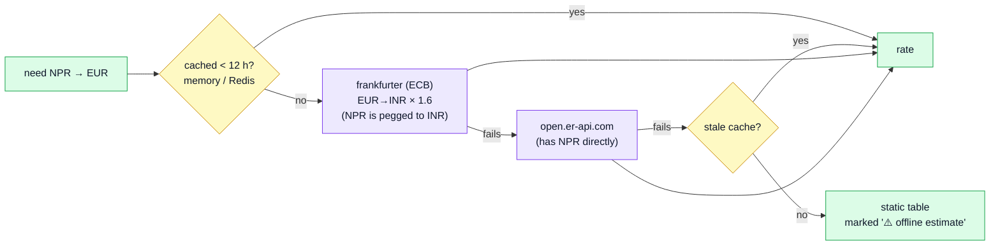
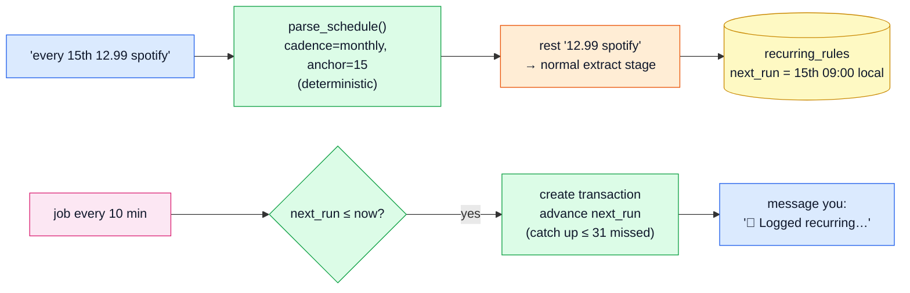
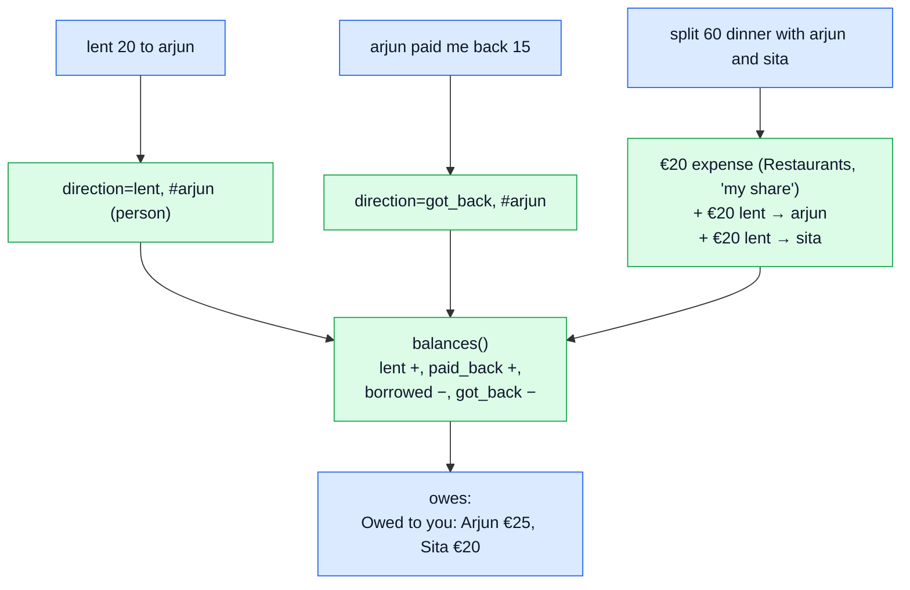
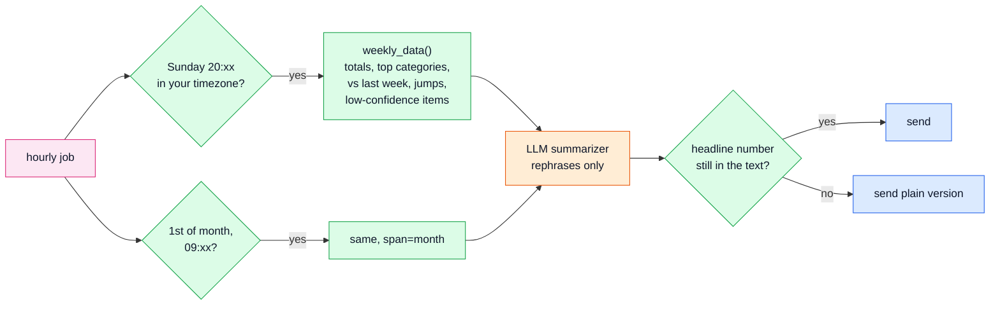
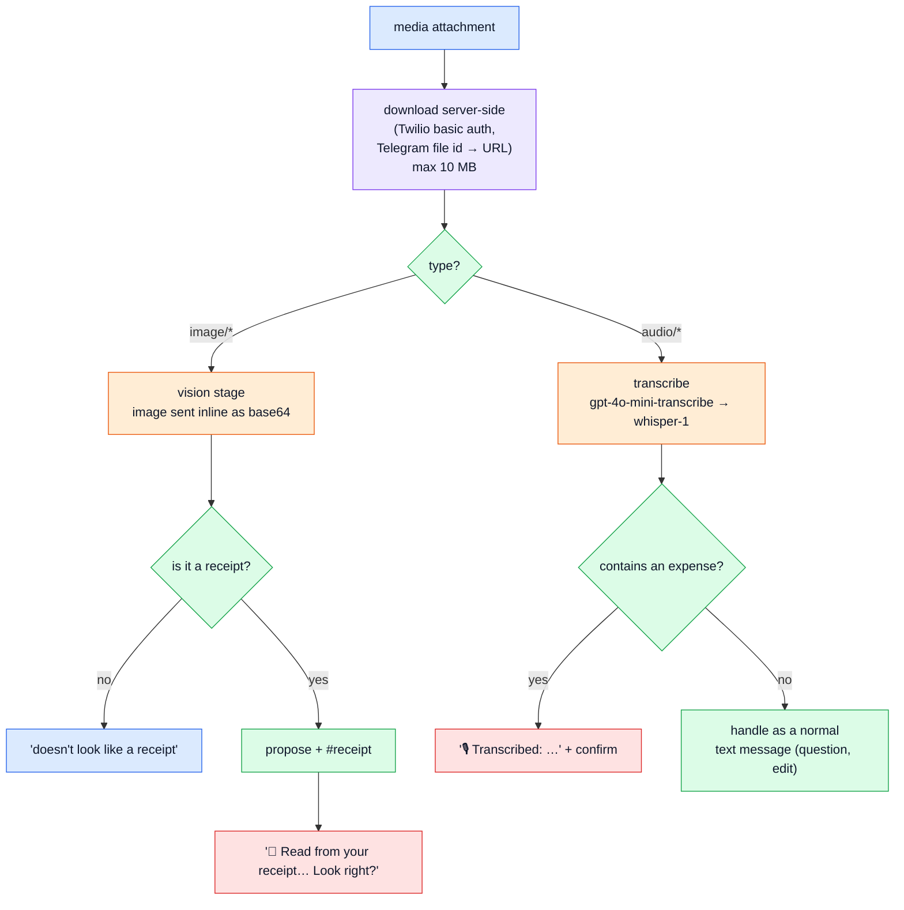

# 6. Features & commands

## Everything you can say

**Natural language** (goes through the LLM stages):

| You say | What happens |
|---|---|
| `23 eur groceries at rimi today` | logged: €23.00 · Groceries · #rimi |
| `coffee 4.5 and metro 2` | "Two transactions?" → `yes` / `1` / `2` / a correction |
| `chiya 30 rs aja` · `momo २५० रु` | logged in NPR, converted to your base currency |
| `got salary 2500` · `refund 30 from zalando` | income |
| `sorry it was 29` · `make that groceries` · `the coffee was yesterday` | edits the last one (or whichever you describe) |
| `delete the coffee one` · `remove last two` | soft delete, asks if unclear |
| `how much on food this month?` · `top merchants last month` · `average weekday coffee spend` · `biggest expenses this year` · `how much with arjun this year` | queries |
| `lent 20 to arjun` · `arjun paid me back 15` · `borrowed 50 from sita` | lending |
| 📷 receipt photo | read with a vision model, then "Look right?" |
| 🎙️ voice note | transcribed, then handled like text, always confirmed |
| `14 eur TV tower when I went to pirita beach` | merchant "TV tower", 📍 location "Pirita beach" |
| 📍 location pin right after logging | fills the location with the city (if empty) and tags it |

**Commands** (exact, instant, never use an LLM; `core/commands.py`):

| Command | Does |
|---|---|
| `undo`, `u` | reverse the last add/edit/delete (5 min) |
| `edit`, `e`, `recent`, `list 10` | numbered recent list |
| `edit 2 amount 29` · `edit last category groceries` · `edit 1 location kadriorg` · `edit 1 12.50` | direct edit (fields: amount, category, merchant, location, note, date, currency, tags, direction) |
| `delete 3` · `d 1,2` · `delete last` | direct delete |
| `history 1` | every version of a transaction |
| `show today` · `show week` · `today` · `month` · `/week` | quick list for a period |
| `categories` · `category add Pets` · `category rename Cafes to Coffee` · `category merge X into Y` · `category archive X` | category admin |
| `tags` | top tags |
| `budget cafes 80` · `budget groceries 60/week` · `budgets` · `budget remove cafes` | budgets |
| `every 15th 12.99 spotify` · `weekly on monday 30 cleaning` · `recurring` · `recurring stop 2` | recurring |
| `owes` | lending balances |
| `person arjun` | person profile |
| `split 60 dinner with arjun and sita` · `split 45 taxi 3 ways` | group split |
| `goal japan 2000 by march` · `save 200 japan` · `withdraw 100 from japan` · `goals` · `goal done japan` | savings goals |
| `export csv month` · `export qif last month` · `export json all` | signed download link |
| `digest` · `monthly` | weekly / monthly recap now |
| `review` | low-confidence transactions from the last 7 days |
| `cost` · `cost month` | LLM spend by model |
| `currency npr` · `tz Europe/Lisbon` · `tz porto` · `settings` | preferences |
| `help`, `?` | the help text |

## Currency & FX (`services/fx.py`)



The ECB doesn't publish NPR, but the Nepali rupee is pegged to the Indian rupee at 1.6, so NPR goes through INR. The reply shows the rate and its source: "NPR converted at 174.82, ECB 2026-09-25". Changing your base currency (`currency npr`) affects new transactions only; old ones keep the base amount they were logged with.

## Budgets (`services/budgets.py`)

A soft limit per category, per month or week (a budget on a parent covers its children). After every save, an after-commit hook checks the budgets of the categories you just spent in, and adds a line once you're past 80%:

```text
✅ Logged €7.00 · Cafes · #coffee · Today 09:12
🟠 Cafes: €68.00 of €80.00 this month ▓▓▓▓▓▓▓▓░░ 85%
```

🟢 under 80% · 🟠 80–100% · 🔴 over. It never blocks anything; it's information.

## Recurring (`services/recurring.py`)



Schedules: `every 15th`, `every month on the 1st`, `weekly on monday`, `every friday`, `every day`, `yearly on 03-14`. "The 31st" in February becomes the 28th. Foreign-currency rules reuse your last known rate for that currency.

## Lending, splits and people



- Lending never counts as spending; the person tag carries it.
- Splits divide evenly, and leftover cents stay with you (€10 three ways = €3.34 + €3.33 + €3.33). Always confirmed.
- `person arjun` shows what you spent together this year, where, the last time, and the lending balance.

## Savings goals (`services/goals.py`)

`goal japan 2000 by march` creates a goal. `save 200 japan` logs a **transfer** tagged `goal-japan`, so it isn't spending. Progress is the sum of those transfers; with a deadline it also tells you what's needed per month:

```text
🎯 Japan: €800.00 of €2,000.00 ▓▓▓▓░░░░░░ 40% · €171.43/month to make 2027-03-31
```

"saved 20 on groceries" isn't about a goal. If no goal matches and you didn't say "goal", the message falls through to the normal pipeline.

## Insights (`services/insights.py`)

An after-commit hook compares each new expense to the median of its category over the last 90 days (at least 6 data points). At 3× the median and €15+ above it:

```text
📈 That's about 12× your usual Cafes spend (typically €3.25).
```

## Digests (`services/digests.py`)



The numbers are computed in code. The model only makes them read nicely, and if it drops the headline total its text is thrown away.

## Exports (`services/exports.py`)

`export csv month` writes a file to `data/exports/` and replies with a link like `/exports/<file>?exp=…&sig=…`. The signature is an HMAC over the name and expiry (24 h) with your secret key, so links can't be guessed or extended. Files are deleted after 48 h. Formats: **CSV** (spreadsheets), **JSON** (scripts), **QIF** (GnuCash, Quicken, Banktivity import it). The dashboard's "Export CSV" button exports exactly the rows your current filters show.

## Photos & voice (`services/media.py`)



Provider URLs never reach the model: images are downloaded and sent inline, and logged payloads show `<redacted>` instead of the image.

## Importing v1 (`services/import_v1.py`)

`pocket import-v1 old.db --currency NPR` reads the v1 bot's SQLite **read-only** and maps expenses → transactions (keeping the original message), budgets → monthly budgets, and lendings → `lent` + `got_back`. It's a dry run unless you pass `--apply`, and it's idempotent: every imported row is keyed `raw_messages(channel='v1', channel_msg_id='expenses:<id>')`.

Next: [7. Channels](07-channels.md)
