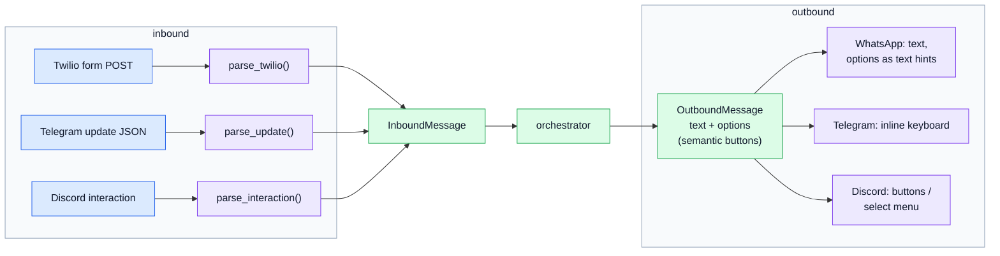
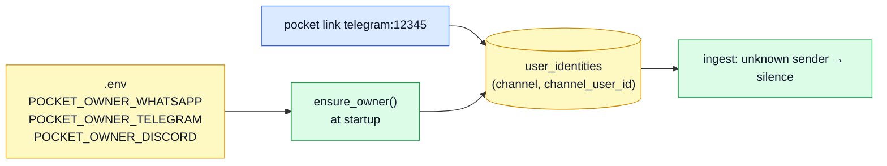

# 7. Channels

A channel adapter (`src/pocket/channels/*.py`) does three jobs:

1. **verify** that a webhook really came from the platform,
2. **parse** the platform's payload into an `InboundMessage`,
3. **send** an `OutboundMessage` back, rendering options as whatever that platform supports.

The orchestrator never sees platform-specific shapes, so adding a channel doesn't touch the core.

**Options are semantic.** The orchestrator returns `Option(value="yes", label="✅ Save all")`. Tapping a button sends back its `value` as if you'd typed it. That's why a Telegram button and a typed "yes" go through exactly the same code.

## WhatsApp via Twilio (`channels/whatsapp.py`)

| | |
|---|---|
| Endpoint | `POST /webhook/whatsapp` (set as the sandbox's "When a message comes in" URL) |
| Verification | `X-Twilio-Signature` = base64(HMAC-SHA1(auth token, full URL + params sorted by name)). The URL is `POCKET_PUBLIC_URL` + path, so that setting must match what Twilio calls. Tested against Twilio's own `RequestValidator`. |
| Parsed | `Body`, `MessageSid` (idempotency key), `From`, media (`MediaUrl0…` + auth for fetching), location pins |
| Reply | Twilio Messages REST API; bodies over 1600 chars are split on line breaks |
| Buttons | none in the sandbox (needs approved Content templates), so options live in the text |
| Gotchas | the sandbox expires after 3 days of silence (send `join <code>` again); free-form messages only within 24 h of your last one (proactive messages fall back to another channel) |

## Telegram (`channels/telegram.py`)

| | |
|---|---|
| Endpoint | `POST /webhook/telegram/<secret>` |
| Verification | the secret in the path **or** the `X-Telegram-Bot-Api-Secret-Token` header (Pocket sets both when registering) |
| Setup | `pocket telegram-webhook` registers the webhook and the `/` command menu |
| Parsed | text/caption, photos (largest size, fetched via `getFile`), voice/audio/documents, location, edited messages (new id `edit:<chat>:<msg>`), button taps (`callback_query`) |
| Reply | `sendMessage` with an inline keyboard; button taps are acknowledged so the spinner stops |
| Commands | `/recent /undo /today /week /month /budgets /owes /digest /help`; the parser strips `/` and `@BotName` |

## Discord (`channels/discord.py`)

| | |
|---|---|
| Endpoint | `POST /webhook/discord` (the app's Interactions Endpoint URL) |
| Verification | Ed25519 over `timestamp + body` with the app's public key (`cryptography` library) |
| Setup | `pocket discord-commands` registers `/pocket text:<message>` and `/receipt <image>` |
| Flow | Discord needs an answer within 3 s, so the webhook replies "thinking…" (deferred, type 5) and the worker posts the real answer as a follow-up on the interaction token |
| Buttons | up to 5 buttons, or a select menu for longer lists |
| Proactive | DM via the bot token |
| Bot mode (plain messages) | `channels/discord_gateway.py` holds a gateway websocket (discord.py) inside the server process and handles **DMs to the bot, @mentions, and every message in `POCKET_DISCORD_CHANNEL_ID`** (that last one needs Message Content Intent in the portal). Replies are posted in the same channel as a reply to your message. On by default when a bot token is set; `POCKET_DISCORD_GATEWAY=false` turns it off |

## CLI and web

- **`pocket chat`** runs everything in-process: ingest (persisting like any channel, channel `cli`), then orchestrator, then print. It works with no server. `pocket chat --remote http://host:8080` talks to a running server via `/webhook/cli` instead.
- **`/webhook/cli`** is a synchronous HTTP channel for scripts and curl. It needs the admin token and returns the replies in the response body.
- **The dashboard's quick-log box** (`POST /api/v1/say`) uses channel `web`, identity `user:<id>`, and the exact same pipeline.

## Who's allowed: identities

Finding your Telegram chat id: send the bot any message, open `/admin`, and the id is on the latest raw message. Then run `pocket link telegram:<id>`.

## Adding a new channel

1. Create `channels/<name>.py` with a `parse_…()` → `InboundMessage`, a `verify_…()`, and an adapter class with `name` and `async send(user_channel_id, message, meta)`.
2. Add `"<name>"` to `ChannelName` in `channels/base.py`.
3. Add a `POST /webhook/<name>` route in `api/webhooks.py`: verify, parse, `await runtime.ingestor.ingest(msg)`, return fast.
4. Register the adapter in `runtime.build_adapters()`.
5. Add an owner setting in `config.py` and to `ensure_owner()` in `wiring.py`.

Next: [8. Dashboard](08-dashboard.md)
