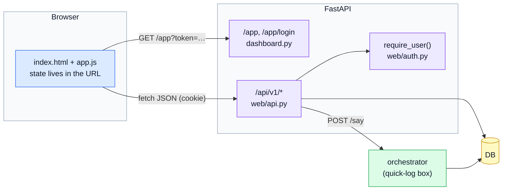
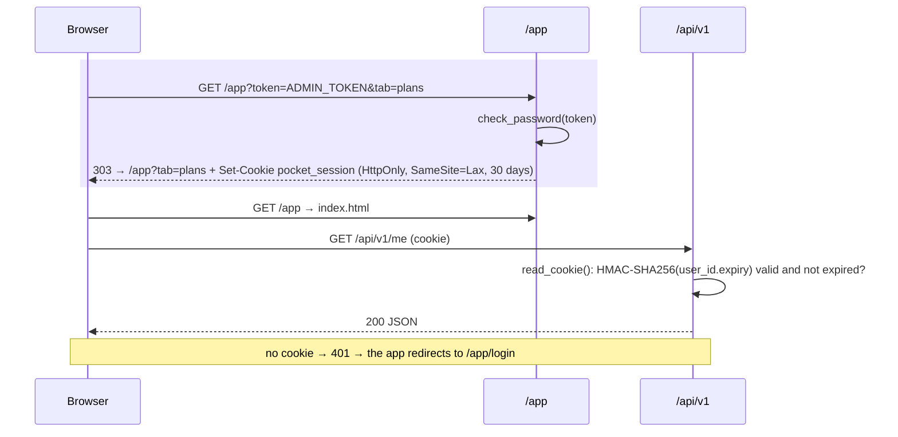
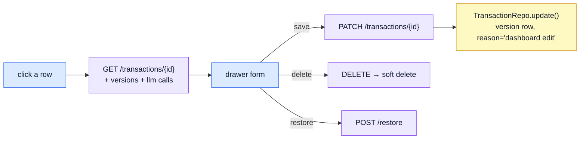

# 8. Dashboard

The web app at `/app` is a single page with **no build step and no frontend dependencies**: `index.html`, `app.js` (vanilla JS, ~900 lines), `app.css`, all in `src/pocket/web/static/`. Charts are hand-drawn SVG. The server side is `web/dashboard.py` (pages, login, static files), `web/api.py` (JSON API) and `web/auth.py`.

## Architecture

## Login

- **The admin token is the password.** It's single-user, so there are no accounts. `/app/login` has a form; the `?token=` link is a shortcut that swaps the token for a cookie and removes it from the URL.
- The cookie is `user_id.expiry.signature`, signed with `POCKET_SECRET_KEY` (or a hash of the admin token). It's `Secure` when `POCKET_PUBLIC_URL` is https.
- Scripts can skip cookies and send `Authorization: Bearer <token>`, so the API doubles as a personal API.
- With no admin token in dev, the dashboard is open. In prod it's always locked.

## The tabs

| Tab | Endpoint(s) | Shows |
|---|---|---|
| **Overview** | `GET /api/v1/summary` | hero spend tile + income/net/count/per-day tiles with deltas vs the previous period; spending per day (≤ 62 days) or per week; by category; top merchants; by weekday; tags; last 12 months spending vs income; largest |
| **Transactions** | `GET /api/v1/transactions` | sortable, paginated table (50/page) with both **Paid at** and **Logged** times; row → drawer with edit form, original message, version history, LLM calls; Export CSV |
| **Imports** | `GET/POST /api/v1/imports`, `/imports/{id}` | drop zone for PDFs and images, past imports with their ✓/⚠ check; the review screen: tiles (found, selected, out, in, already logged), an editable table (tick, paid at, merchant, location, category, type, amount; every change saves immediately), "only rows that need a look", select all/none/skip duplicates, a sticky bar with live totals and **Import N**; afterwards **View transactions** or **Revert import** |
| **Plans** | `GET /api/v1/plans`, `/categories` | budget meters (+ set/remove), lending balances, goals, recurring (+ stop), category rename/merge/archive |
| **System** | `GET /api/v1/system` | LLM spend per day (30 d), calls, failure rate, cost per message, model chains in use, message outcomes, recent raw messages |

## Filters: one source of truth

Every control writes to one `state.f` object, which is mirrored to the URL (`/app?period=last_month&category=3&q=rimi`). So a filtered view is bookmarkable and survives a reload. Every Overview and Transactions request sends the **same** filter params, so tiles, charts and the table always agree.

| Param | Meaning |
|---|---|
| `period` | `today`, `this_week`, `this_month` (default), `last_month`, `last_7_days`, `last_30_days`, `last_90_days`, `this_year`, `last_year`, `all_time` |
| `start`, `end` | custom range (YYYY-MM-DD, inclusive), overrides `period` |
| `direction` | `expense` (default), `income`, `transfer`, `all` |
| `category` | comma-separated ids; children included automatically |
| `merchant`, `tag` | exact |
| `q` | search across merchant, note, category name, tag names |
| `min_amount`, `max_amount` | in base currency |
| `currency` | original currency (`NPR`) |
| `low_confidence` | only parses under 0.85 |
| `deleted` | show the soft-deleted ones |

Clicking a category bar, merchant bar or tag toggles that filter. Clicking a day column jumps to the Transactions tab for that day.

## Charts

Built by three small functions in `app.js`: `columnChart()` (SVG columns with gridlines, nice tick steps, hover tooltips, keyboard focus), `hbars()` (HTML horizontal bars, top N + "Other") and `dataTable()` (the "Table" toggle on every chart, so no number is only reachable by hover).

Design rules they follow:
- **Colors are validated**, not eyeballed: the palette passed a colorblind-safety check in light and dark mode. A single series is always blue; spending vs income uses blue vs orange.
- Thin bars (≤ 24px) with rounded tops and square bottoms, hairline gridlines, labels in text colors (never in the series color).
- Budget meters use status colors (blue → amber → red) **plus** an icon and a word (✓ on track / ⚠ close / ⛔ over), so the meaning never depends on color alone.
- Dark mode is its own palette, not an inverted light one. It follows your OS, with a toggle (◐) remembered in `localStorage`.
- While data reloads, the old charts stay on screen dimmed: no spinners, no layout jumps.

## Editing from the dashboard

Dashboard edits go through the same repository as chat edits, so they're versioned the same way and show up in `history`.

## Quick log

The box in the top bar posts to `POST /api/v1/say`, which runs the **same** ingest → orchestrator path as WhatsApp (channel `web`). Replies appear under the bar, and buttons (`yes`, `1`, `a`…) send their value back. After each message the facets and current tab refresh.

## Install on your phone

`manifest.webmanifest` + `icon.svg` make it installable: "Add to Home Screen" in Safari/Chrome opens it full-screen like an app.

## API reference

All under `/api/v1`, cookie or bearer auth:

| Method | Path | |
|---|---|---|
| GET | `/me` | base currency, timezone |
| GET | `/summary` | everything for Overview (filters apply) |
| GET | `/transactions` | + `import` (only rows from that import), `sort` (occurred_at, amount, merchant, category, created_at), `order`, `page`, `page_size` |
| GET | `/transactions/{id}` | detail + versions + raw text + LLM calls |
| PATCH | `/transactions/{id}` | amount, currency, category_id, merchant, note, occurred_at, direction, tags |
| DELETE | `/transactions/{id}` | soft delete |
| POST | `/transactions/{id}/restore` | undelete |
| GET | `/facets` | options for the filter dropdowns |
| GET | `/export.csv` | filtered CSV |
| POST | `/say` | `{"text": "..."}` → replies |
| GET | `/plans` | budgets, recurring, lending, goals, monthly fixed costs |
| POST / DELETE | `/budgets`, `/budgets/{id}` | set / remove |
| DELETE | `/recurring/{id}` | stop a rule |
| GET / POST / PATCH | `/categories`, `/categories/{id}` | list with counts; create; rename / merge_into / archive |
| GET | `/system` | LLM cost and health |
| GET / POST | `/imports` | list; upload a PDF or image (multipart `file`), read in the background |
| GET | `/imports/{id}` | the import with its rows (poll while `status` is `processing`) |
| PATCH | `/imports/{id}/rows/{row_id}` | include, category_id, direction, merchant, location, note, occurred_at, amount |
| POST | `/imports/{id}/include` | `{"include": false, "only_duplicates": true}` and friends |
| POST | `/imports/{id}/commit` · `/cancel` · `/revert` | create the transactions · discard · soft-delete what it created |

Next: [9. Operations](09-operations.md)
