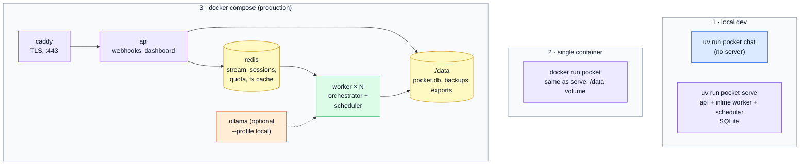
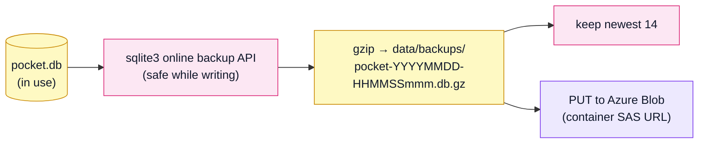
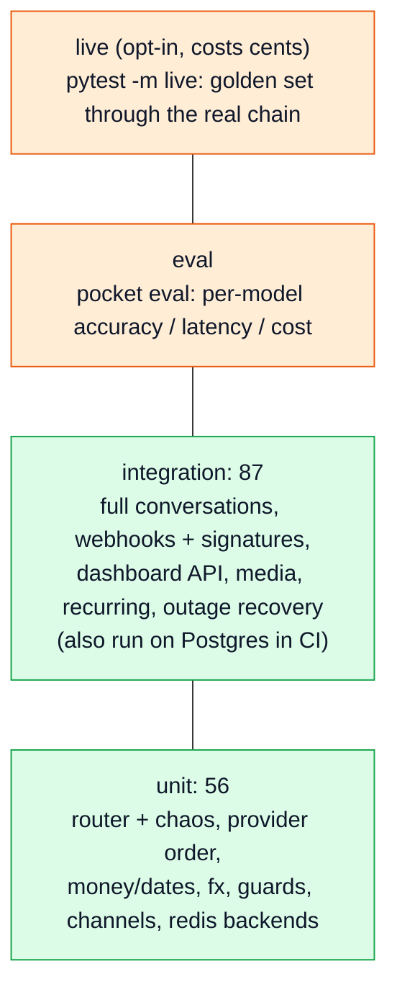

# 9. Operations

Config, deployment, background jobs, backups, debugging, security, tests, and how to extend Pocket.

## Configuration

All settings come from environment variables (or `.env`), prefixed `POCKET_`, defined in `src/pocket/config.py`. LLM keys are *not* prefixed because LiteLLM reads them directly.

| Setting | Default | What |
|---|---|---|
| `POCKET_ENV` | `dev` | `prod` locks admin/dashboard without a token, hides `/docs` |
| `POCKET_DATABASE_URL` | `sqlite:///data/pocket.db` | or `postgresql+psycopg://user:pw@host/db` |
| `POCKET_REDIS_URL` | – | enables Redis sessions, quota counters, FX cache, rate limits |
| `POCKET_QUEUE_BACKEND` | `inline` | `redis` = Redis Streams + separate `pocket worker` processes |
| `POCKET_PUBLIC_URL` | `http://localhost:8080` | must match what Twilio calls (part of the signature); used in export links |
| `POCKET_ADMIN_TOKEN` | – | dashboard password + admin/API bearer token |
| `POCKET_SECRET_KEY` | – | signs cookies and export links (falls back to a hash of the admin token) |
| `POCKET_DEFAULT_BASE_CURRENCY` / `_TIMEZONE` | `EUR` / `Europe/Tallinn` | for the first user |
| `POCKET_OWNER_WHATSAPP` / `_TELEGRAM` / `_DISCORD` | – | the allowlist |
| `POCKET_TWILIO_ACCOUNT_SID` / `_AUTH_TOKEN` / `_WHATSAPP_FROM` | – | WhatsApp |
| `POCKET_TELEGRAM_BOT_TOKEN` / `_WEBHOOK_SECRET` | – | Telegram |
| `POCKET_DISCORD_PUBLIC_KEY` / `_BOT_TOKEN` / `_APPLICATION_ID` | – | Discord |
| `POCKET_DISCORD_GATEWAY` / `_CHANNEL_ID` | `true` / – | bot mode for plain messages; optional channel where every message is read |
| `POCKET_VERIFY_SIGNATURES` | `true` | only turn off in local testing |
| `POCKET_LLM_CONFIG_PATH` | `config/llm.yaml` | `config/llm.local.yaml` for Ollama-only |
| `POCKET_LLM_PROVIDER_ORDER` | – (YAML order: OpenAI, Gemini) | e.g. `gemini,openai` re-sorts every chain |
| `POCKET_LLM_DAILY_COST_CAP_USD` | `1.0` | after this, no more model calls until midnight UTC |
| `POCKET_LLM_TIMEOUT_S` | `10` | per model call |
| `POCKET_CONFIDENCE_COMMIT` / `_ASK` | `0.85` / `0.6` | policy thresholds |
| `POCKET_UNDO_WINDOW_MINUTES` / `_PENDING_TTL_MINUTES` / `_DUPLICATE_WINDOW_MINUTES` | 5 / 15 / 5 | conversation timing |
| `POCKET_RATE_LIMIT_PER_MIN` / `_QUERY_RATE_LIMIT_PER_MIN` | 30 / 5 | per user |
| `POCKET_SCHEDULER_ENABLED` | `true` | run background jobs in this process |
| `POCKET_DIGEST_WEEKDAY` / `_HOUR` | 6 / 20 | Sunday 20:00 local |
| `POCKET_BACKUP_KEEP` / `_BACKUP_AZURE_SAS_URL` | 14 / – | backups |
| `POCKET_PURGE_DELETED_AFTER_DAYS` | 0 (off) | hard-delete old soft-deleted rows |
| `OPENAI_API_KEY`, `GEMINI_API_KEY`, `XAI_API_KEY`, `OLLAMA_API_BASE` | – | at least one is required; models without a key are skipped |

## Ways to run it

**Local with real chat apps (`make dev` → `scripts/dev.sh`):** starts or reuses an ngrok tunnel to :8080, writes the URL into `.env`, starts `pocket serve`, points the Discord Interactions Endpoint and Telegram webhook at the tunnel, and tails `data/server.log`.

**Production (`docker compose up -d`):**
- `api` runs `pocket migrate` then uvicorn with proxy headers. It persists and enqueues but doesn't process (`POCKET_SCHEDULER_ENABLED=false`, Redis queue).
- `worker` runs `pocket worker`: consumes the stream and runs the scheduler, so jobs run in exactly one place. `--scale worker=2` adds more.
- `caddy` gets a certificate for `POCKET_DOMAIN` automatically.
- The image runs as a non-root user, with a health check hitting `/healthz`; data lives on the `./data` volume.

**Docker Desktop on macOS:** the credential helper can hang image pulls waiting on a Keychain prompt. If `docker build` sits at "load metadata", build with `DOCKER_CONFIG=$(mktemp -d)` (an empty config).

## Background jobs (`services/scheduler.py`)

| Job | When (UTC) | Does |
|---|---|---|
| `reprocess` | every 2 min | re-queue messages never processed or stuck on `llm_unavailable` |
| `recurring` | every 10 min | post due recurring transactions |
| `digest` | hourly at :02 | weekly (Sunday 20:xx local) and monthly (1st, 09:xx local) recaps |
| `backup` | 01:30 | SQLite backup → gzip → keep 14 → optional Azure Blob |
| `purge` | 02:10 | drop LLM request/response payloads older than 30 days (keep the numbers) |
| `purge_deleted` | 1st of month 03:00 | hard-delete old soft-deleted rows, if enabled |
| `purge_exports` | 03:40 | delete export files older than 48 h |

## Backups

- `pocket backup`: back up now.
- `pocket restore data/backups/<file>.gz`: stop the app first. It copies the current DB to `*.before-restore-<time>`, restores, and runs an integrity check.
- Postgres: `pg_dump` if it's installed.

## Observability & debugging

When something parses wrong, go down this list:

1. **The reply itself.** Low confidence says "not fully sure"; `review` lists shaky ones.
2. **`/admin?token=…`** lists every raw message verbatim with its outcome, and a **replay** button.
3. **Replay** (`POST /admin/replay/{id}`, or `pocket replay 42`) re-runs the whole pipeline on a stored message inside a transaction that's rolled back. You see every stage, every LLM call and the reply, with no side effects. `?commit=true` makes it real. It runs against *current* state (pending questions, recent transactions), not the state at the time.
4. **`llm_calls`** (`/admin/llm_calls?raw_message_id=42`, or the dashboard drawer's "Pipeline" section) has the exact request and response for every attempt, including failed ones and which model finally answered.
5. **Logs**: one JSON line per message (`event=message_handled`) with the stages, latency and cost. `POCKET_LOG_JSON=true` in prod.
6. **`/readyz`** checks DB, Redis and which models are usable for extraction. It flags `llm_offline_only: true` if every real provider is misconfigured.
7. **Cost**: `cost` in chat, `/admin/cost` (HTML) / `/admin/cost.json`, and the dashboard's System tab.

Other admin endpoints: `/admin/quota` (free-tier counters, usable models), `POST /admin/reload` (re-read `llm.yaml` without a restart), `POST /admin/reprocess`.

## Security model

| Threat | Mitigation |
|---|---|
| Someone POSTs fake webhooks | signature verification per channel; fails closed |
| A stranger finds the bot | allowlist (`user_identities`); unknown senders get silence |
| Webhook replay / Twilio retries | unique `(channel, channel_msg_id)` |
| Runaway loop burning LLM credit | 30 msg/min per user, 5 queries/min, daily $ cap |
| Dashboard access | token → HMAC-signed, expiring, HttpOnly, SameSite=Lax cookie; bearer for scripts |
| XSS in the dashboard | all data inserted with `textContent`; admin pages `html.escape` everything |
| Guessable export links | HMAC-signed with a 24 h expiry; files deleted after 48 h |
| Path traversal in static/export routes | resolved paths must stay inside their folder |
| API surface discovery | no `/docs` or `/openapi.json` in prod |
| Provider URLs / images leaking into logs | media sent inline; logged payloads redact images |
| Secrets in git | `.env` ignored; `.env.example` has placeholders only |

## Tests

- `make test` (or `uv run pytest`) runs everything in ~10 s: no network, no keys.
- Integration tests use a fixed clock (Monday 21:14 Tallinn), a scripted **stub LLM** (`tests/support/stub_llm/`, test-only: word lists that fill the same schemas a model would), a static FX table, and a `FakeBackend` for exact per-test LLM answers.
- `POCKET_TEST_DATABASE_URL=postgresql+psycopg://… uv run pytest tests/integration` runs the integration suite on Postgres.
- CI (`.github/workflows/ci.yml`): lint → mypy → tests → migrations, then the Postgres job, then the image build/push to GHCR, then an optional SSH deploy.

## Extending Pocket

**Add a chat command.** In `core/commands.py`, return `Command("name", {...})` for your pattern. In a `services/<feature>.py`, write `async def handler(o, t, cmd) -> list[OutboundMessage]` and register it in `install(services)` with `services.orchestrator.extra_commands["name"] = handler`. Add the module to `_install_features()` in `wiring.py`. If the command is read-only, add it to `READ_ONLY_COMMANDS` so it doesn't clear the undo target.

**React to every saved transaction.** Append a function `(turn, saved_transactions) -> str | None` to `orchestrator.after_commit`; a returned string is added to the reply (this is how budgets and insights work).

**Add or reorder a model.** Edit `config/llm.yaml`: any LiteLLM model id works (`anthropic/claude-…`, `ollama_chat/…`), plus the matching API key in `.env`. Then `POST /admin/reload` or restart, and `pocket eval --models <id>` to see how it does.

**Add an LLM stage.** Define the output schema in `llm/schemas.py`, write `llm/prompts/<stage>.md`, add a `Pipeline` method in `llm/stages.py`, map the purpose to a chain in `llm.yaml`, and teach the test stub (`tests/support/stub_llm/parser.py`) to answer it so conversation tests can cover it.

**Change a table.** Edit `data/models.py`, run `uv run alembic revision --autogenerate -m "…"`, review the file, and commit it.

## Troubleshooting

| Symptom | Likely cause |
|---|---|
| WhatsApp: no reply, 403 in logs | `POCKET_PUBLIC_URL` doesn't match the URL Twilio calls, or the wrong auth token |
| WhatsApp: worked, then silence | sandbox expired after 3 days; send `join <code>` again |
| Replies say "parsers are having a moment" | every model in a chain failed; check `/readyz` and `/admin/llm_calls` |
| Replies are slow sometimes | a fallback to Gemini happened (its free tier p95 was ~15 s in the benchmark); check `/admin/llm_calls` for why OpenAI failed |
| "Hit today's AI budget" | `POCKET_LLM_DAILY_COST_CAP_USD` reached; commands still work |
| "My parsers are having a moment" on every message | no working API key; `/readyz` lists usable models |
| Telegram: nothing arrives | run `pocket telegram-webhook`; check the secret |
| Dashboard redirects to login forever | no/incorrect `POCKET_ADMIN_TOKEN`, or the cookie is `Secure` on plain http |
| `database is locked` | two processes writing the same SQLite file heavily; use Postgres or `queue_backend=redis` with one writer |
