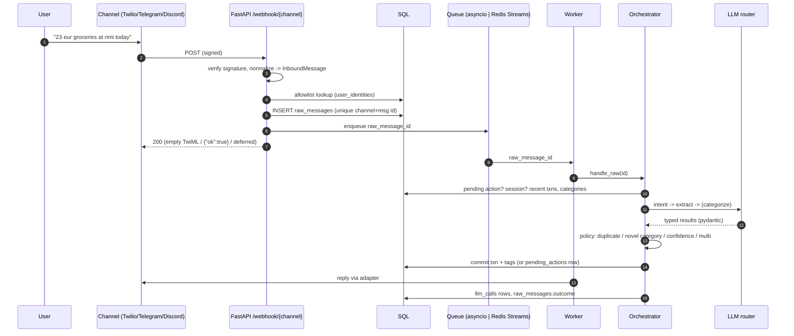

# Pocket: architecture as built

This describes the system as it exists in the code, and where and why it
differs from the original design doc (v2).

## 1. Request lifecycle

Webhook handlers do nothing slow: they verify, persist, enqueue and ack. The
worker always re-reads the message from the DB, which is the source of truth,
so a crashed worker or a Redis restart can't lose input. Stuck messages
(`processed_at IS NULL`, or `outcome = llm_unavailable`) are re-queued every 2
minutes.

**Queue modes.** `POCKET_QUEUE_BACKEND=inline` (default) runs an asyncio
consumer inside the API process: zero ops, right for one user.
`redis` uses a Redis Stream with a consumer group, so `docker compose up --scale
worker=N` works. Un-acked entries are reclaimed with `XAUTOCLAIM`.

## 2. The orchestrator

`core/orchestrator.py` is a state machine, in this order:

0. **Normalize** (`core/normalize.py`): NFKC, zero-width chars, smart quotes, email/phone signatures, Devanagari digits (२५० → 250). The stored raw message is untouched.

1. **Media?** Photos go to the receipt (vision) stage and voice notes to transcription, then the text path. Always confirmed.
2. **Pending action?** Kinds are `confirm_add`, `confirm_category`, `confirm_duplicate`, `choose_target`, `confirm_delete`. A reply that isn't an answer ("how much this week?") clears the pending action and is handled fresh, so the bot never gets stuck in a question.
3. **Deterministic command?** (`core/commands.py`): undo, edit/delete by number, show, budgets, recurring, export, categories, settings... No LLM, so these work during outages and when the cost cap is hit.
4. **Intent** (LLM, fast chain), then one of:
   - **ADD** → extract → per transaction: FX convert, categorize, tags, duplicate check → policy
   - **EDIT** → resolve target + field changes against the numbered recent list → apply with a version row
   - **DELETE** → resolve → soft delete (asks when ambiguous or low-confidence)
   - **QUERY** → query plan → deterministic executor (`services/queries.py`)
   - **HELP / CHITCHAT** → fixed replies (anti-goal: no "chat with your money")

Features plug in without touching the core: `extra_commands` (budgets,
recurring, exports, lending, people, digest), `after_commit` hooks (budget
nudges) and `media_handler`.

### Categorization is deterministic first

1. Learned merchant mapping: where did this merchant go most often before?
2. Name/stem/keyword/fuzzy match of the extractor's `category_hint` against the user's categories.
3. Only then the LLM categorizer. If it proposes a new name, that is fuzzily matched again; a truly new category needs the user's confirmation (a / b / c).

Most messages never need a categorizer call.

### Policy (as implemented, `core/policy.py`)

| Situation | Action |
|---|---|
| near-identical txn (same amount+currency+direction, same merchant if any) within 5 min | ask "Looks like a repeat" |
| novel category | a) create b) Miscellaneous c) name one |
| any confidence < 0.6 | ask before saving |
| more than one transaction | ask (yes / 1 / 2 / "tell me what's off") |
| 0.6 ≤ confidence < 0.85 | save, with "Not fully sure" |
| otherwise | save, one-line receipt |
| receipt photo / voice note | always ask |

Confidence is the *minimum* across stages (extract, categorize), not the product.

"Tell me what's off" is handled by running the edit resolver against the pending
proposals instead of the saved transactions, then asking again.

## 3. LLM layer

- `llm/router.py` walks a per-purpose chain from `config/llm.yaml`. The failover rules are explicit code, not LiteLLM's Router:
  - rate limit, timeout, 5xx, context length → next model
  - schema validation failure → same model once more, then next
  - 404 / auth → next model, and bench this one for an hour
  - within 5% of a configured free-tier quota → skipped before calling (counters in Redis when available)
  - daily cost cap hit → only `free` backends run (the offline rules parser)
- **Backends by model prefix:** `rules/*` (offline parser), `fake/*` (tests), everything else via LiteLLM. Models without credentials are skipped, so the same config works with any subset of keys.
- **`rules/v1`** (`llm/rules/`) implements every stage deterministically: currency/amount lexer (€, eur, rs, rupees, 1.2k, 6,50, 1,200), multi-transaction splitting, dates (aja/hijo/yesterday/on friday/15 sep/3 days ago), merchants, people, lending verbs, query planning. It's the last fallback everywhere, and the default with no keys.
- **Prompts** live in `llm/prompts/*.md`. Layout is `[system: persona + profile + categories]` `[system: stage instructions]` `[user: message]`, so the prefix is stable per user per day for implicit prompt caching (Gemini/OpenAI). Anthropic models get explicit `cache_control`.
- **Every attempt** is logged to `llm_calls`: request, response, tokens, latency, cost, error kind. Calls are buffered per message and written after the transaction, so SQLite's single writer isn't contended mid-turn.

## 4. Data model

As designed, plus:

| Change | Why |
|---|---|
| `user_identities(channel, channel_user_id)` table instead of `users.channel_ids JSON` | indexable, unique, identical on SQLite/Postgres. It is the allowlist. |
| `raw_messages.user_channel_id`, `channel_meta`, `processed_at`, `outcome` | reply routing (e.g. the Discord interaction token), crash recovery, per-message outcome for debugging |
| `sessions` table | session state survives restarts without Redis (Redis store is used when configured) |
| `budgets`, `recurring_rules` | §12.11/12.12 |
| directions `lent / borrowed / got_back / paid_back` | lending tracker (§12.13). Excluded from spend/income. |

Edits write `transaction_versions` rows *and* update the row (the doc's first
option). Undo reverses the exact version rows the last edit wrote.

## 5. Channels

| | inbound auth | quick replies | proactive messages |
|---|---|---|---|
| WhatsApp (Twilio) | `X-Twilio-Signature` HMAC-SHA1 over the public URL + params | rendered into text (sandbox has no Content templates) | Messages API |
| Telegram | secret path segment or `X-Telegram-Bot-Api-Secret-Token` | inline keyboard (callback → value) | sendMessage |
| Discord | Ed25519 over timestamp+body | buttons / select | DM via bot token |
| CLI / web | admin token / dashboard session | printed / buttons | n/a |

## 6. Web dashboard

`/app` is a no-build SPA (vanilla JS + SVG charts) over `/api/v1/*`:

- `summary`: tiles, per-day/week series, category/merchant/tag/weekday breakdowns, 12-month income vs spend, largest; with previous-period deltas
- `transactions`: filterable (period/custom range, direction, category tree, merchant, tag, full-text-ish search, amount range, currency, low-confidence, deleted), sortable, paginated
- `PATCH/DELETE/restore` with version rows; `say` runs the same chat pipeline from the browser; `export.csv`; `system` (LLM cost, chains, outcomes)

Auth: the admin token is the password, exchanged for an HMAC-signed, expiring,
HttpOnly cookie. Bearer tokens also work (personal API).

## 7. Deviations from the design doc, and why

1. **Models.** `gemini-2.5-*` return 404 for new API keys and `2.5-pro` has no free quota, so the chains use `gemini-flash-lite-latest` (fast, reliable) and `gemini-3.8-flash`, with `gpt-4o-mini` as the paid safety net. Measured: 3.8-flash returns 503 "high demand" often and is ~2x slower than flash-lite with no accuracy gain on the golden set, so it's a fallback, except for query planning.
2. **Dashboard auth** is token → cookie, not Google OAuth. A single-user tool shouldn't need an OAuth app (see ROADMAP.md).
3. **Discord** uses the HTTP interactions endpoint (slash commands + buttons), not a gateway bot, to keep the service stateless. Plain DMs to the bot are therefore not received.
4. **Tags (Stage D)** come from the extractor's structured output plus deterministic normalization, instead of a separate LLM call. Same result, one fewer call per message.
5. **Summarizer** only rephrases the weekly digest. Query answers are formatted deterministically, so numbers can't be hallucinated. The digest falls back to the plain version if the model drops the headline number.
