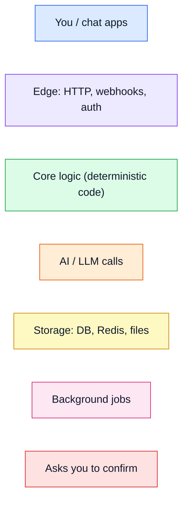

# Pocket documentation

Read these in order the first time. Each one stands on its own after that.

| # | Doc | What you'll understand after |
|---|---|---|
| 1 | [Overview](01-overview.md) | what Pocket is, the big picture, where every file lives |
| 2 | [Life of a message](02-message-lifecycle.md) | exactly what happens between "23 eur groceries" and the ✅ reply |
| 3 | [The orchestrator](03-orchestrator.md) | the state machine: commands, intents, confirmations, undo |
| 4 | [The LLM layer](04-llm-layer.md) | stages, prompts, fallback chains, guards, the offline parser, the benchmark |
| 5 | [Data model](05-data-model.md) | every table, money rules, versions and soft deletes |
| 6 | [Features & commands](06-features.md) | everything you can say, and how each feature works inside |
| 7 | [Channels](07-channels.md) | WhatsApp, Telegram, Discord, CLI/web: auth, parsing, replies |
| 8 | [Dashboard](08-dashboard.md) | the web app: API, auth, charts, how the frontend is built |
| 9 | [Operations](09-operations.md) | config, deploy, background jobs, backups, debugging, security, tests, extending |

Also useful:
- [ARCHITECTURE.md](ARCHITECTURE.md): the short "as built" summary and every deviation from the original design doc
- [eval.md](eval.md): model benchmark results
- [../ROADMAP.md](../ROADMAP.md): what's planned next

## Color code used in every diagram

| Color | Means |
|---|---|
| 🟦 blue | people and the chat apps they use |
| 🟪 purple | the edge: HTTP endpoints, signature checks, the dashboard server |
| 🟩 green | deterministic code: same input, same output, easy to test |
| 🟧 orange | anything that calls an LLM (non-deterministic, costs money, can fail) |
| 🟨 yellow | storage: SQLite/Postgres, Redis, files on disk |
| 🩷 pink | scheduled background jobs |
| 🟥 red | a point where Pocket stops and asks you before doing anything |

The one idea behind the whole design: **orange boxes only ever propose; green boxes decide.**
